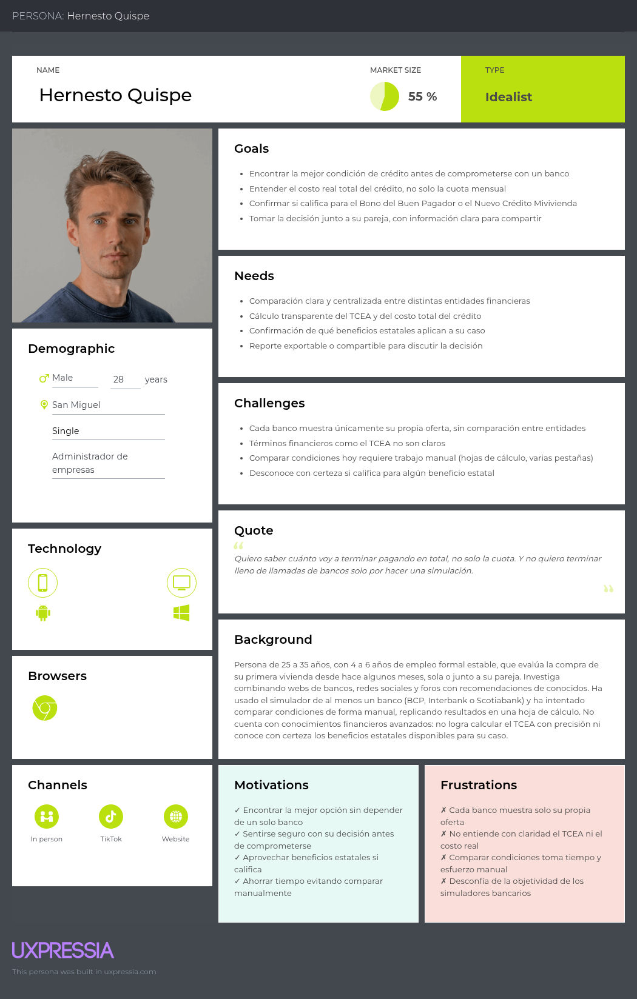
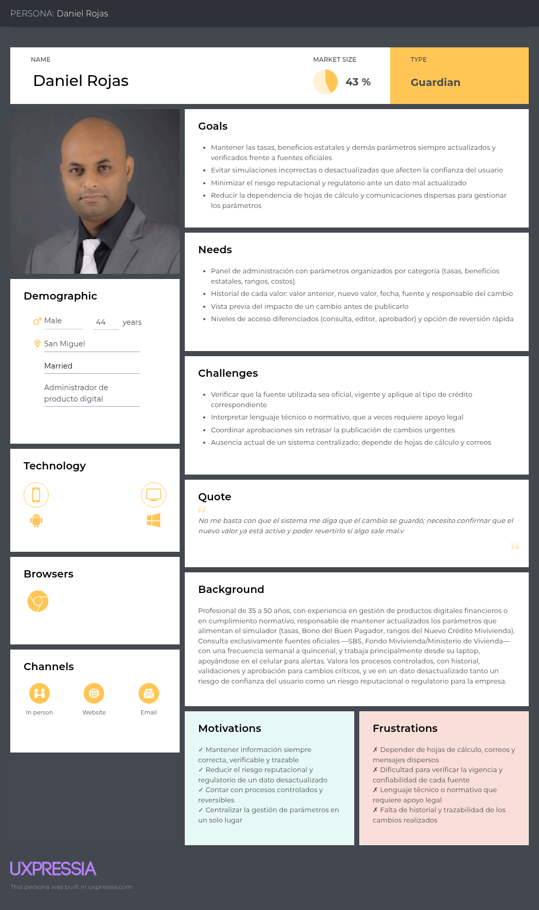

# **Chapter II: Requirements Elicitation & Analysis**
## **2.1. Competitors**
Conocer el entorno competitivo es fundamental para identificar las fortalezas y debilidades de HipoSim frente a las alternativas que hoy utilizan los compradores de primera vivienda en Perú para estimar el costo real de un crédito hipotecario. Este análisis permite entender cómo cada entidad expone su información de simulación, con o sin independencia frente al propio banco que la ofrece, y qué limitaciones presentan sus herramientas actuales.

En esta etapa se analizan distintos tipos de competidores con el objetivo de comprender sus fortalezas, debilidades y enfoque de mercado, y así posicionar a HipoSim como una propuesta que responda de manera más efectiva a la necesidad real del comprador primerizo: comparar condiciones reales de forma independiente antes de comprometerse con un banco.

### **2.1.1. Competitive Analysis**

Para desarrollar una solución realmente útil, es fundamental comprender las alternativas que actualmente utiliza un comprador de primera vivienda en Perú para simular un crédito hipotecario. Este análisis permite identificar no solo cómo se informan hoy los usuarios, sino también las principales limitaciones de las herramientas existentes.

A continuación, se presenta una comparación de los principales competidores considerando su propuesta de valor, mercado objetivo y características generales. Este análisis evidencia que, mientras las soluciones existentes están integradas dentro del canal comercial de una entidad específica —ya sea un banco privado o el propio Fondo Mivivienda— HipoSim se posiciona como una alternativa independiente, centrada en mostrar el costo efectivo real (TCEA) y los beneficios estatales aplicables en un solo lugar, sin sesgo comercial hacia ninguna entidad.

<table border="1" cellpadding="10" cellspacing="0" style="margin-left: auto; margin-right: auto; font-family: sans-serif;">
<tr>
<th colspan="6">Panorama del análisis competitivo</th>
</tr>
<tr>
<td colspan="2" rowspan="2"><b>¿Por qué llevar a cabo este análisis?</b></td>
<td colspan="4">¿Cómo se posiciona HipoSim frente a sus competidores en cuanto a fortalezas, debilidades, oportunidades y su propuesta de valor dentro del proceso de simulación de crédito hipotecario en Perú?</td>
</tr>
<tr>
<td colspan="4">Es una propuesta que posiciona a HipoSim como un simulador independiente de crédito hipotecario, sin afiliación a ninguna entidad financiera, que integra el método de amortización francés, la conversión de tasas, los periodos de gracia y los indicadores TCEA, VAN y TIR, junto con la visibilidad de beneficios estatales, frente a herramientas que hoy están confinadas al canal comercial de cada banco o programa estatal.</td>
</tr>
<tr>
<td colspan="2" style="text-align: center;"><b>Competidores</b></td>
<td style="text-align: center; vertical-align: middle;">
<b>HipoSim</b>

</td>
<td style="text-align: center; vertical-align: middle;">
<b>Simulador BCP (ViaBCP)</b>

</td>
<td style="text-align: center; vertical-align: middle;">
<b>Simulador Interbank</b>

</td>
<td style="text-align: center; vertical-align: middle;">
<b>Simulador Fondo Mivivienda</b>

</td>
</tr>
<tr>
<td rowspan="2"><b>Perfil</b></td>
<td>Overview</td>
<td>Simulador web y móvil independiente de crédito hipotecario para compradores de primera vivienda en Perú, que modela el método de amortización francés, la conversión de tasas y los indicadores TCEA, VAN y TIR.</td>
<td>Calculadora hipotecaria integrada dentro del canal digital ViaBCP, que estima la cuota mensual según el valor de la vivienda, el porcentaje de cuota inicial y el plazo elegido.</td>
<td>Calculadora hipotecaria del canal digital de Interbank, que permite simular créditos convencionales y bajo la modalidad Nuevo Crédito Mivivienda, ajustando el tipo de cuota.</td>
<td>Herramienta oficial del Fondo Mivivienda para estimar el crédito bajo el programa Nuevo Crédito Mivivienda, aplicando las fórmulas normativas de Tasa de Costo Efectivo (TCED) y el subsidio del Bono del Buen Pagador (BBP).</td>
</tr>
<tr>
<td>Ventaja competitiva</td>
<td>Independencia frente a cualquier entidad financiera, visualización comparativa del TCEA y beneficios estatales, comparador de escenarios y reporte exportable en PDF.</td>
<td>Marca líder del sistema financiero peruano e integración directa con el proceso real de solicitud del propio banco.</td>
<td>Tasa competitiva dentro del mercado privado y opción integrada de modalidad Mivivienda dentro del mismo canal digital del banco.</td>
<td>Único canal oficial autorizado para calcular con exactitud el subsidio estatal (BBP) y el Nuevo Crédito Mivivienda conforme a la normativa vigente.</td>
</tr>
<tr>
<td rowspan="2"><b>Perfil de Marketing</b></td>
<td>Mercado objetivo</td>
<td>Compradores de primera vivienda de 25 a 40 años en Perú, con empleo formal estable y sin experiencia previa comparando créditos.</td>
<td>Clientes actuales y potenciales de BCP interesados en un crédito hipotecario propio del banco.</td>
<td>Clientes actuales y potenciales de Interbank, incluyendo quienes califican para el Nuevo Crédito Mivivienda a través de este banco.</td>
<td>Familias peruanas elegibles para el subsidio estatal, dentro de los rangos de precio de vivienda establecidos por el programa.</td>
</tr>
<tr>
<td>Estrategias de marketing</td>
<td>Posicionamiento como comparador independiente y educativo, enfocado en la transparencia del costo real (TCEA) y en la difusión de beneficios estatales.</td>
<td>Captación de clientes hipotecarios dentro del ecosistema propio del banco a través del canal digital ViaBCP.</td>
<td>Comunicación de tasas competitivas y facilidad para acceder a Mivivienda dentro del mismo flujo digital del banco.</td>
<td>Comunicación institucional del Estado sobre el Bono del Buen Pagador y los rangos de precios del Nuevo Crédito Mivivienda.</td>
</tr>
<tr>
<td rowspan="3"><b>Perfil de Producto</b></td>
<td>Productos & Servicios</td>
<td>Simulador con método francés, cálculo de TCEA/VAN/TIR, periodos de gracia, comparador de escenarios, historial de simulaciones, toggle de beneficios estatales y reporte exportable en PDF.</td>
<td>Calculadora de cuota mensual según plazo y porcentaje de cuota inicial, con acceso al detalle del crédito hipotecario del banco.</td>
<td>Calculadora de cuota con selección de tipo de cuota y modalidad Mivivienda.</td>
<td>Cálculo del monto de crédito, cuota y cronograma bajo las fórmulas oficiales del programa, incluyendo el Bono del Buen Pagador.</td>
</tr>
<tr>
<td>Precios & Costos</td>
<td>Acceso gratuito; producto digital independiente sin cobro directo al usuario final.</td>
<td>Sin costo de uso del simulador; el costo real depende de la tasa y condiciones del crédito otorgado por el banco.</td>
<td>Sin costo de uso del simulador; costo real sujeto a la evaluación crediticia del banco.</td>
<td>Sin costo de uso del simulador oficial; el subsidio (BBP) reduce el costo real del crédito para quienes califican.</td>
</tr>
<tr>
<td>Canales de distribución</td>
<td>Web y aplicación móvil propia.</td>
<td>Sitio web ViaBCP.</td>
<td>Sitio web y aplicación móvil de Interbank.</td>
<td>Sitio web oficial del Fondo Mivivienda y bancos participantes del programa.</td>
</tr>
<tr>
<td rowspan="5"><b>Análisis SWOT</b></td>
</tr>
<tr>
<td>Fortalezas</td>
<td>Independencia de cualquier banco, visualización comparativa del TCEA y los beneficios estatales en un solo lugar, comparador de escenarios y reporte compartible.</td>
<td>Marca líder y confianza del sistema financiero, integración directa con el proceso real de solicitud.</td>
<td>Tasa competitiva dentro del mercado privado e integración de la modalidad Mivivienda en el mismo flujo.</td>
<td>Único canal oficial válido para el cálculo exacto del subsidio estatal, con normativa clara y verificable.</td>
</tr>
<tr>
<td>Debilidades</td>
<td>Producto nuevo sin reconocimiento de marca, sin relación comercial directa con bancos ni otorgamiento de créditos, dependiente de la actualización manual de tasas y parámetros.</td>
<td>Muestra únicamente la oferta propia del banco, sin comparación con otras entidades ni con los beneficios estatales de forma integrada.</td>
<td>Misma limitación de mostrar solo su propia oferta; la información puede percibirse como comercialmente sesgada.</td>
<td>Solo aplica al Nuevo Crédito Mivivienda (no a créditos hipotecarios convencionales); su cálculo formal (TCED iterativo) resulta poco intuitivo para un usuario sin conocimientos financieros.</td>
</tr>
<tr>
<td>Oportunidades</td>
<td>Bajo conocimiento del TCEA real y de los beneficios estatales entre compradores primerizos, y creciente investigación informal previa a la compra.</td>
<td>Ampliar su simulador con mayor transparencia del costo total para reducir el uso de herramientas externas.</td>
<td>Reforzar la integración de Mivivienda como diferenciador frente a otros bancos.</td>
<td>Mayor difusión digital del programa hacia compradores primerizos.</td>
</tr>
<tr>
<td>Amenazas</td>
<td>Mejora de los simuladores propios de cada banco, desconfianza inicial del usuario al ingresar datos financieros en una plataforma independiente, y posible entrada de fintechs comparadoras similares.</td>
<td>Pérdida de clientes que comparan condiciones fuera de su canal antes de decidir.</td>
<td>Clientes que comparan condiciones en herramientas independientes antes de acercarse al banco.</td>
<td>Bajo conocimiento del programa entre la población objetivo, lo que limita su alcance real.</td>
</tr>
</table>

A partir del análisis comparativo, se identifican las siguientes diferencias clave:

- Frente a los simuladores de BCP e Interbank, HipoSim no depende de ninguna entidad financiera y no muestra únicamente la oferta de un solo banco, sino que permite comparar condiciones de forma independiente antes de iniciar un proceso comercial.
- A diferencia del simulador oficial del Fondo Mivivienda, que se enfoca exclusivamente en el cálculo normativo del Nuevo Crédito Mivivienda mediante fórmulas poco accesibles para un usuario sin formación financiera, HipoSim traduce ese mismo tipo de beneficio estatal en una visualización simple y comparable junto con créditos hipotecarios convencionales.
- En los tres casos, los simuladores existentes están confinados al canal comercial de la entidad que los ofrece, lo cual coincide directamente con el problema de negocio identificado en el Capítulo I: no existe hoy un producto independiente que permita a un comprador primerizo explorar y comparar escenarios reales de crédito hipotecario por su cuenta.

En conjunto, este análisis permite concluir que HipoSim no compite como un producto bancario ni reemplaza al canal oficial del Fondo Mivivienda, sino que ocupa un espacio diferenciado: el de una herramienta independiente que traduce información dispersa y entidad-específica en una simulación transparente y comparable, dirigida específicamente al comprador de primera vivienda en la etapa previa a su acercamiento formal a un banco.

### **2.1.2. Strategies and Tactics Against Competitors**

Una vez identificados los actores del mercado y las principales diferencias entre las alternativas existentes, resulta necesario definir cómo HipoSim puede fortalecer su posicionamiento competitivo frente a simuladores bancarios ya consolidados y al canal oficial del Fondo Mivivienda.

Con este objetivo, se emplea la Matriz CAME, la cual permite transformar el análisis FODA en estrategias y acciones concretas. A través de esta herramienta se plantean tácticas orientadas a potenciar las fortalezas diferenciales de HipoSim —su independencia, la visualización comparativa del TCEA y de los beneficios estatales— así como a mitigar las debilidades propias de un producto nuevo sin relación comercial directa con las entidades financieras.

Las estrategias definidas buscan:
* Aprovechar el bajo conocimiento del TCEA real y de los beneficios estatales entre los compradores primerizos para posicionar a HipoSim como fuente de información clara.
* Comunicar el valor de la independencia y la transparencia frente a simuladores confinados al canal comercial de una sola entidad.
* Reducir la desconfianza inicial del usuario al ingresar datos financieros personales mediante una experiencia simple y sin barreras de entrada.
* Posicionar a HipoSim como el punto de referencia informativo antes de que el comprador primerizo se acerque a un banco.

Matriz CAME para el desarrollo de estrategias basadas en el análisis FODA.

| **Análisis FODA cruzado** | **Oportunidades** | **Amenazas** |
|---------------------------|------------------|--------------|
| **Fortalezas (F)** 1. Independencia frente a cualquier entidad financiera. 2. Visualización comparativa del TCEA y de los beneficios estatales. 3. Comparador de escenarios e historial de simulaciones para usuarios registrados. 4. Acceso web y móvil, sin necesidad de crear cuenta para ver un primer resultado. 5. Reporte de simulación exportable y compartible en PDF. | **Estrategia (FO) — Estrategias Ofensivas** 1. Posicionar a HipoSim como el único comparador independiente que muestra el TCEA real y los beneficios estatales en un solo lugar. 2. Aprovechar el bajo conocimiento del TCEA para educar al usuario mediante visualizaciones claras y comparativas. 3. Difundir el comparador de escenarios y el reporte PDF como herramienta para discutir la decisión en familia o con un asesor. 4. Dirigir campañas hacia compradores primerizos que investigan informalmente antes de acercarse a un banco. | **Estrategia (FA) — Estrategias Defensivas** 1. Reforzar la transparencia e independencia frente a los simuladores bancarios como principal diferenciador de marca. 2. Mantener una actualización rigurosa y frecuente de tasas y parámetros (rol Administrador) para sostener la confianza del usuario. 3. Comunicar explícitamente las políticas de privacidad y limitar la solicitud de datos sensibles al mínimo necesario. 4. Monitorear los simuladores bancarios y posibles fintechs comparadoras para anticipar mejoras funcionales. |
| **Debilidades (D)** 1. Producto nuevo sin reconocimiento de marca. 2. Sin relación comercial directa con bancos ni otorgamiento de créditos. 3. Dependencia de la actualización manual de tasas y parámetros. 4. Alcance inicial limitado al segmento comprador primerizo. | **Estrategia (DO) — Reorientación** 1. Priorizar el MVP con la visualización comparativa de TCEA y beneficios (H2) antes de invertir en el comparador y el historial. 2. Aprovechar la tendencia de digitalización financiera para ganar visibilidad pese a ser un producto nuevo. 3. Usar el acceso sin barrera de entrada al primer resultado para impulsar la adopción progresiva. 4. Explorar la actualización semiautomatizada de tasas y beneficios estatales para reducir la dependencia manual del Administrador. | **Estrategia (DA) — Supervivencia** 1. Mantener el alcance acotado al comprador primerizo mientras se valida el modelo, sin competir directamente con bancos o el canal oficial de Mivivienda. 2. Simplificar el ingreso de datos personales al mínimo indispensable para reducir la fricción y la desconfianza inicial. 3. Evaluar una futura alianza informativa (no comercial) con el Fondo Mivivienda para validar la exactitud de los beneficios mostrados. 4. Priorizar el mantenimiento actualizado de las tasas de los bancos de referencia (BCP, Interbank) antes de expandir a más entidades. |

## **2.2. Interviews**

Las entrevistas son clave para la metodología de diseño centrado en el usuario, al permitir recolectar información cualitativa directamente del comprador de primera vivienda: cómo investiga hoy, qué tan bien entiende el costo real de un crédito hipotecario y qué fricciones enfrenta antes de acercarse a un banco.

### **2.2.1. Interview Design**

## Segmento 1: Comprador de Primera Vivienda:

Preguntas Personales  

1. ¿Cuál es su nombre, edad y distrito de residencia?

2. ¿Cuál es su ocupación actual y hace cuánto tiene un empleo formal estable?

3. ¿Está actualmente evaluando la compra de su primera vivienda?

4. ¿Qué dispositivo utiliza con más frecuencia para informarse sobre temas financieros?

5. ¿Qué canal usa normalmente para informarse: bancos, redes sociales, recomendaciones u otro?

6. ¿Qué parte de este proceso le genera mayor dificultad o frustración?

Preguntas Específicas

1. ¿Sabe qué es el TCEA y cómo se calcula?

2. ¿Ha usado algún simulador de crédito hipotecario? ¿De qué banco?

3. ¿Confía en que ese simulador es objetivo e independiente? ¿Por qué?

4. ¿Ha comparado las condiciones de más de un banco antes de decidir? ¿Cómo?

5. ¿Conocía el Bono del Buen Pagador o el Nuevo Crédito Mivivienda?

6. ¿Qué información necesita para sentirse seguro antes de acercarse a un banco?

7. ¿Ingresaría sus datos financieros (ingresos, ahorro, precio de vivienda) en una herramienta independiente para simular? ¿Por qué?

8. ¿Le interesaría guardar, comparar o exportar sus simulaciones?

## Segmento 2: Administrador de producto:

Preguntas personales

1. ¿Cuál es su nombre, edad y cargo dentro del equipo o la organización?

2. ¿Cuál sería su rol respecto al mantenimiento de tasas y parámetros del producto?

3. ¿Qué fuentes usa hoy para obtener esa información: SBS, bancos, Fondo Mivivienda u otra?

4. ¿Con qué frecuencia necesitaría actualizar estos datos?

5. ¿Qué herramienta o dispositivo usa con más frecuencia para esta tarea?

6. ¿Qué parte de este proceso le genera mayor dificultad?

Preguntas Específicas

1. ¿Qué parámetros necesita mantener actualizados: tasas referenciales, porcentaje del Bono del Buen Pagador, rangos Mivivienda u otros?

2. ¿Qué tan seguido cambian estos valores y qué tan rápido deberían reflejarse en el sistema?

3. ¿Qué riesgo representa que un valor quede desactualizado?

4. ¿Qué tan simple le resultaría actualizar estos valores desde un panel de administración?

5. ¿Qué métricas de uso le interesaría monitorear, como simulaciones realizadas o tasa de conversión?

6. ¿Qué nivel de acceso o permisos considera necesario para realizar estas tareas de forma segura?

7. ¿Confía en que los cambios que realice se reflejarán correctamente y a tiempo en el simulador?

8. ¿Qué funcionalidad le facilitaría esta tarea, como alertas de cambio de tasas o un historial de modificaciones?

### **2.2.2. Interview Recording**

# Segmento 1: Comprador de Primera Vivienda:

<table>
    <colgroup></colgroup>
    <thead>
        <tr>
            <th colspan="2">Entrevista #1 </th>
        </tr>
    </thead>
    <tbody>
        <tr>
            <td>Nombre</td>
            <td>Vitaly</td>
        </tr>
        <tr>
            <td>Apellidos</td>
            <td>Baca Arturo</td>
        </tr>
        <tr>
            <td>Edad</td>
            <td>25 años</td>
        </tr>
        <tr>
            <td>Distrito</td>
            <td>Lurín, Lima*</td>
        </tr>
        <tr>
            <td>Evidencia</td>
            <td style="text-align: left;">
                

            </td>
        </tr>
        <tr>
            <td>Link</td>
            <td>
                <a href="https://upcedupe-my.sharepoint.com/:v:/g/personal/u202315890_upc_edu_pe/IQAF5AyST2rQSp1Vf_9zuk_9AaycEdJysPCj3KbCrMCFYoU?e=wSeJ4W&nav=eyJyZWZlcnJhbEluZm8iOnsicmVmZXJyYWxBcHAiOiJTdHJlYW1XZWJBcHAiLCJyZWZlcnJhbFZpZXciOiJTaGFyZURpYWxvZy1MaW5rIiwicmVmZXJyYWxBcHBQbGF0Zm9ybSI6IldlYiIsInJlZmVycmFsTW9kZSI6InZpZXcifX0%3D" target="_blank">
                Entrevista #1 - segmento 1
            </a>
            </td>
        </tr>
        <tr>
            <td>Timing donde inicia la entrevista </td>
            <td>0:00 min</td>
        </tr>
        <tr>
            <td>Duración de la entrevista </td>
            <td>8:13 min</td>
        </tr>
        <tr>
            <td>Resumen</td>
            <td>Vitaly trabaja como analista de marketing hace 4 años y evalúa junto a su pareja, desde hace 6 meses, la compra de un departamento como primera vivienda. Se informa principalmente por celular, a través de redes sociales (TikTok, Instagram), la web de BCP —banco con el que ya tiene una relación previa— y recomendaciones de amigos y su padre. Su principal frustración es que cada banco muestra únicamente su propia información, lo que dificulta comparar, y que términos como el TCEA no le resultan claros: sabe que representa el costo real del crédito más allá de la tasa anunciada, pero no sabría calcularlo. Ha usado el simulador de Interbank (a través de su padre) y no confía en que sea objetivo, ya que percibe que cada banco muestra la información que más le conviene. Para comparar bancos, replicó manualmente los resultados de cada simulador en una hoja de cálculo. Conocía el Nuevo Crédito Mivivienda pero no sabía si calificaba, y se enteró del Bono del Buen Pagador hace poco por un amigo. Antes de acercarse a un banco, necesita saber el costo total del crédito y si califica para algún beneficio estatal. Estaría dispuesto a ingresar sus datos financieros en una herramienta independiente para simular, siempre que no le exija crear cuenta de inmediato ni derive en llamadas comerciales; además, le interesaría guardar y comparar 2-3 escenarios y exportar un reporte en PDF para decidir junto con su pareja.</td>
        </tr>
    </tbody>
</table>

<table>
    <colgroup></colgroup>
    <thead>
        <tr>
            <th colspan="2">Entrevista #2 </th>
        </tr>
    </thead>
    <tbody>
        <tr>
            <td>Nombre</td>
            <td></td>
        </tr>
        <tr>
            <td>Apellidos</td>
            <td></td>
        </tr>
        <tr>
            <td>Edad</td>
            <td></td>
        </tr>
        <tr>
            <td>Distrito</td>
            <td></td>
        </tr>
        <tr>
            <td>Evidencia</td>
            <td style="text-align: left;">
                

            </td>
        </tr>
        <tr>
            <td>Link</td>
            <td>
                <a href="#" target="_blank">
                [pendiente]
            </a>
            </td>
        </tr>
        <tr>
            <td>Timing donde inicia la entrevista </td>
            <td></td>
        </tr>
        <tr>
            <td>Duración de la entrevista </td>
            <td></td>
        </tr>
        <tr>
            <td>Resumen</td>
            <td></td>
        </tr>
    </tbody>
</table>

<table>
    <colgroup></colgroup>
    <thead>
        <tr>
            <th colspan="2">Entrevista #3 </th>
        </tr>
    </thead>
    <tbody>
        <tr>
            <td>Nombre</td>
            <td></td>
        </tr>
        <tr>
            <td>Apellidos</td>
            <td></td>
        </tr>
        <tr>
            <td>Edad</td>
            <td></td>
        </tr>
        <tr>
            <td>Distrito</td>
            <td></td>
        </tr>
        <tr>
            <td>Evidencia</td>
            <td style="text-align: left;">
                

            </td>
        </tr>
        <tr>
            <td>Link</td>
            <td>
                <a href="#" target="_blank">
                [pendiente]
            </a>
            </td>
        </tr>
        <tr>
            <td>Timing donde inicia la entrevista </td>
            <td></td>
        </tr>
        <tr>
            <td>Duración de la entrevista </td>
            <td></td>
        </tr>
        <tr>
            <td>Resumen</td>
            <td></td>
        </tr>
    </tbody>
</table>

# Segmento 2: Administrador de Producto

<table>
    <colgroup></colgroup>
    <thead>
        <tr>
            <th colspan="2">Entrevista #1 </th>
        </tr>
    </thead>
    <tbody>
        <tr>
            <td>Nombre</td>
            <td>Carlos</td>
        </tr>
        <tr>
            <td>Apellidos</td>
            <td>Mendoza Ríos</td>
        </tr>
        <tr>
            <td>Edad</td>
            <td>50</td>
        </tr>
        <tr>
            <td>Distrito</td>
            <td>San Miguel</td>
        </tr>
        <tr>
            <td>Evidencia</td>
            <td style="text-align: left;">
                

            </td>
        </tr>
        <tr>
            <td>Link</td>
            <td>
                <a href="https://upcedupe-my.sharepoint.com/:v:/g/personal/u202315890_upc_edu_pe/IQAKtbbSWlxbTasU9NmG1xyzAQXK_8J5hF1RC25yCku2iHo?e=sgcwsZ&nav=eyJyZWZlcnJhbEluZm8iOnsicmVmZXJyYWxBcHAiOiJTdHJlYW1XZWJBcHAiLCJyZWZlcnJhbFZpZXciOiJTaGFyZURpYWxvZy1MaW5rIiwicmVmZXJyYWxBcHBQbGF0Zm9ybSI6IldlYiIsInJlZmVycmFsTW9kZSI6InZpZXcifX0%3D" target="_blank">
                Entrevista #1 - segmento 2
            </a>
            </td>
        </tr>
        <tr>
            <td>Timing donde inicia la entrevista </td>
            <td>0:00</td>
        </tr>
        <tr>
            <td>Duración de la entrevista </td>
            <td>15:32</td>
        </tr>
        <tr>
            <td>Resumen</td>
            <td>
                Carlos Mendoza Ríos (50 años) es administrador de productos digitales, responsable de centralizar y supervisar la información que alimenta el simulador: identifica cambios en tasas y condiciones de programas estatales, actualiza los datos y verifica que se apliquen correctamente. Usa como fuentes la SBS, las páginas oficiales de los bancos y el Fondo Mivivienda/Ministerio de Vivienda, revisando la información semanalmente pese a la actual estabilidad de tasas. Trabaja principalmente desde su laptop corporativa, con acceso a paneles de administración, tablas y documentos oficiales. Su mayor dificultad no es el cambio del dato en sí, sino verificar que la fuente sea oficial y confiable, que el valor corresponda al tipo de crédito y fecha correctos, e interpretar lenguaje técnico o normativo (a veces requiere apoyo legal). Entre los parámetros que mantiene están las tasas de interés (nominal y efectiva), los porcentajes y límites del Bono del Buen Pagador, los rangos de vivienda para el Nuevo Crédito Mivivienda, los montos de financiamiento, la cuota inicial mínima, los plazos, periodos de gracia, costos administrativos, seguros y comisiones. Ve como principal riesgo de un dato desactualizado que el usuario obtenga una simulación incorrecta, pierda confianza en la herramienta, o que se genere un riesgo reputacional y fuga de clientes. Espera que un panel de administración lo guíe en un proceso controlado (parámetros por categoría, historial de cada valor, vista previa del impacto en una simulación de ejemplo, validaciones de formato/rango, aprobación para cambios críticos), y le interesa monitorear métricas como simulaciones completadas, tasa de conversión hacia guardar/exportar/compartir, parámetros más usados y abandono por etapa. Propone niveles de acceso diferenciados (consulta, editor, aprobador) y solo confiaría en el sistema si cuenta con confirmación detallada, una simulación de prueba tras cada actualización y opción de reversión rápida. La funcionalidad que más le facilitaría el trabajo es un centro de administración con alertas de cambios en fuentes oficiales y un historial completo de modificaciones con opción de comparar y restaurar versiones.
            </td>
        </tr>
    </tbody>
</table>

<table>
    <colgroup></colgroup>
    <thead>
        <tr>
            <th colspan="2">Entrevista #2 </th>
        </tr>
    </thead>
    <tbody>
        <tr>
            <td>Nombre</td>
            <td></td>
        </tr>
        <tr>
            <td>Apellidos</td>
            <td></td>
        </tr>
        <tr>
            <td>Edad</td>
            <td></td>
        </tr>
        <tr>
            <td>Distrito</td>
            <td></td>
        </tr>
        <tr>
            <td>Evidencia</td>
            <td style="text-align: left;">
                

            </td>
        </tr>
        <tr>
            <td>Link</td>
            <td>
                <a href="#" target="_blank">
                [pendiente]
            </a>
            </td>
        </tr>
        <tr>
            <td>Timing donde inicia la entrevista </td>
            <td></td>
        </tr>
        <tr>
            <td>Duración de la entrevista </td>
            <td></td>
        </tr>
        <tr>
            <td>Resumen</td>
            <td></td>
        </tr>
    </tbody>
</table>

<table>
    <colgroup></colgroup>
    <thead>
        <tr>
            <th colspan="2">Entrevista #3 </th>
        </tr>
    </thead>
    <tbody>
        <tr>
            <td>Nombre</td>
            <td></td>
        </tr>
        <tr>
            <td>Apellidos</td>
            <td></td>
        </tr>
        <tr>
            <td>Edad</td>
            <td></td>
        </tr>
        <tr>
            <td>Distrito</td>
            <td></td>
        </tr>
        <tr>
            <td>Evidencia</td>
            <td style="text-align: left;">
                

            </td>
        </tr>
        <tr>
            <td>Link</td>
            <td>
                <a href="#" target="_blank">
                [pendiente]
            </a>
            </td>
        </tr>
        <tr>
            <td>Timing donde inicia la entrevista </td>
            <td></td>
        </tr>
        <tr>
            <td>Duración de la entrevista </td>
            <td></td>
        </tr>
        <tr>
            <td>Resumen</td>
            <td></td>
        </tr>
    </tbody>
</table>

### **2.2.3. Interview Analysis**

A partir de las entrevistas realizadas al segmento Comprador de Primera Vivienda, se identifican patrones comunes y particularidades relevantes para la definición del arquetipo de usuario. Dado que este análisis se basa en 2 entrevistas correspondientes al avance de este entregable, los hallazgos se presentan en términos cualitativos; se recomienda ampliar la muestra al mínimo de 5-6 entrevistas indicado en la sección 2.2.2 antes de la entrega final.

#### Análisis de características objetivas y subjetivas

En esta sección se presenta el análisis detallado de la información recolectada de las entrevistas al segmento Comprador de Primera Vivienda. Se explican primero los hallazgos estadísticos objetivos y subjetivos, seguidos de la evidencia gráfica correspondiente y la definición del arquetipo de usuario. Dado que este análisis se basa en 2 entrevistas (Vitaly Bacacamargo Arturo y Camila Fernández Ríos) correspondientes al avance de este entregable, los hallazgos se presentan como una primera aproximación cualitativa; se recomienda ampliar la muestra al mínimo de 5-6 entrevistas indicado en la sección 2.2.2 antes de la entrega final.

**Segmento 1: Comprador de Primera Vivienda**

**Análisis de Características Objetivas y Subjetivas:**

El análisis de las entrevistas evidencia que la búsqueda de una primera vivienda es un proceso activo y sostenido en el tiempo: el 100% de los entrevistados se encuentra evaluando la compra desde hace 3 a 6 meses y cuenta con empleo formal estable de 4 a 6 años, lo que valida el criterio de acceso a crédito definido para este segmento. Asimismo, el 100% combina más de un canal para informarse (web bancaria, redes sociales o foros, y recomendaciones cercanas), y el 100% ha utilizado al menos un simulador hipotecario de un banco (Interbank, BCP o Scotiabank). En cuanto al dispositivo principal de consulta, se observa una división pareja: el 50% se informa principalmente desde el celular, mientras que el 50% restante utiliza laptop, lo que sugiere que HipoSim debe ofrecer una experiencia consistente en ambos formatos.

A nivel subjetivo, el 100% de los entrevistados manifestó baja confianza en la objetividad de los simuladores bancarios, aunque por razones distintas: la mitad percibe un sesgo comercial hacia la entidad, mientras que la otra mitad percibe falta de transparencia en costos adicionales como seguros y gastos notariales. De igual forma, el 100% no logra comprender con claridad el TCEA —el 50% lo asocia correctamente con el costo real del crédito sin saber calcularlo, mientras que el 50% restante lo confunde directamente con la tasa de interés simple—, y el 100% desconocía con certeza si calificaba para algún beneficio estatal antes de la entrevista. Además, el 100% recurre actualmente a comparaciones manuales entre bancos (hojas de cálculo o revisión pestaña por pestaña) ante la ausencia de una herramienta que centralice esta información.

En conjunto, se observa que el Comprador de Primera Vivienda busca disponer de información confiable e independiente sobre el costo real de un crédito hipotecario y los beneficios estatales a los que podría acceder, antes de comprometerse con una entidad financiera específica.

 

 

**Segmento 2: Administrador**

**Análisis de Características Objetivas y Subjetivas:**

El análisis de las entrevistas evidencia que el mantenimiento de los parámetros del simulador es una labor que exige rigurosidad y trazabilidad frente a fuentes oficiales. El 100% de los entrevistados consulta exclusivamente fuentes oficiales y verificables —SBS y Fondo Mivivienda/Ministerio de Vivienda— para actualizar tasas y beneficios estatales, y el 100% utiliza laptop como herramienta principal de trabajo, aunque un 50% complementa esta labor con el celular para recibir alertas fuera de horario. Respecto a la frecuencia de revisión, se observa una diferencia: el 50% revisa la información semanalmente pese a la actual estabilidad de tasas, mientras que el 50% restante lo hace de forma quincenal, salvo que se active una alerta urgente. Asimismo, el 100% mantiene un conjunto de parámetros equivalente: tasas de interés, porcentajes del Bono del Buen Pagador y rangos del Nuevo Crédito Mivivienda.

A nivel subjetivo, el 100% coincide en que la mayor dificultad no está en modificar el valor dentro del sistema, sino en verificar la vigencia y confiabilidad de la fuente y en interpretar un lenguaje técnico o normativo que en ocasiones requiere apoyo legal. Respecto al riesgo de un dato desactualizado, se observan énfasis distintos: el 50% lo asocia principalmente con la pérdida de confianza del usuario final y el riesgo reputacional del producto, mientras que el 50% restante enfatiza el riesgo regulatorio y legal frente a organismos supervisores. El 100% espera que el panel de administración organice los parámetros por categoría, muestre el historial de cada valor y permita una vista previa del impacto antes de publicar un cambio, y el 100% solo confiaría en el sistema si cuenta con confirmación detallada, una opción de reversión rápida y niveles de acceso diferenciados (consulta, editor, aprobador).

En conjunto, se observa que el Administrador busca centralizar y documentar la actualización de parámetros financieros y estatales del simulador, reduciendo la dependencia de hojas de cálculo y comunicaciones dispersas, y asegurando que cada cambio quede respaldado, aprobado y sea reversible.

 

 

##### Conclusiones y Definición de Arquetipos

A partir del análisis realizado, se define el siguiente perfil de usuario (User Persona):

*Arquetipo: "El Comprador Primerizo"*

**Característica principal:** Persona de 25 a 35 años, con empleo formal estable de al menos 4 años, que investiga activamente la compra de su primera vivienda combinando canales digitales y recomendaciones cercanas, sin depender de una sola entidad o simulador.

**Necesidad principal:** Comprender el costo real total de un crédito hipotecario y conocer con certeza si califica para beneficios estatales como el Bono del Buen Pagador o el Nuevo Crédito Mivivienda, antes de acercarse formalmente a un banco.

**Principal dificultad:** La información disponible está fragmentada y sesgada hacia cada entidad financiera, lo que lo obliga a comparar manualmente y le genera desconfianza sobre si realmente está viendo la mejor opción disponible.

*Arquetipo: "El administrados de parámetros"*

**Característica principal:** Profesional de 35 a 50 años responsable de mantener actualizados y conformes a la normativa vigente los parámetros financieros y estatales del simulador, trabajando con fuentes oficiales y, en ocasiones, coordinando con áreas técnicas o legales.

**Necesidad principal:** Contar con un panel de administración estructurado y trazable que permita actualizar parámetros con historial, validaciones, vista previa de impacto y niveles de aprobación, sin depender de hojas de cálculo o comunicaciones dispersas.

**Principal dificultad:** Verificar la vigencia y confiabilidad de cada fuente oficial e interpretar lenguaje técnico o normativo, garantizando que cada cambio quede debidamente documentado y aprobado antes de publicarse, dado el riesgo reputacional y regulatorio de un dato desactualizado.

## **2.3. Needfinding**
### **2.3.1. User Personas**

En esta sección se presentan los User Personas definidos para HipoSim a partir de la información recopilada durante las entrevistas realizadas a los segmentos de dueños primerizos, y administradores de producto. Estos perfiles sintetizan sus principales características, objetivos, necesidades, motivaciones, frustraciones y comportamientos, permitiendo comprender mejor a los usuarios objetivo y orientar el diseño de la solución hacia sus necesidades reales.

### Segmento 1: Comprador de primera vivienda

 

### Segmento 2: Administrador de Producto

### **2.3.2. User Task Matrix**

La matriz de tareas de usuario permite identificar, para cada segmento, las principales tareas que realiza en relación con el problema que HipoSim busca resolver, junto con la frecuencia con la que las realiza y la importancia que tienen para él. Esta información, derivada de las entrevistas realizadas, sirve como base para priorizar las funcionalidades del producto.

#### Segmento 1: Comprador de Primera Vivienda

| # | Tarea | Frecuencia | Importancia |
|---|-------|------------|-------------|
| 1 | Buscar información sobre créditos hipotecarios en distintos canales (redes sociales, webs bancarias, recomendaciones) | Alta | Alta |
| 2 | Simular una cuota de crédito en el simulador de un banco | Media | Alta |
| 3 | Comparar manualmente los resultados de distintos simuladores bancarios (ej. en una hoja de cálculo) | Media | Alta |
| 4 | Verificar si califica para el Bono del Buen Pagador o el Nuevo Crédito Mivivienda | Baja | Alta |
| 5 | Entender el TCEA y el costo total del crédito | Baja | Alta |
| 6 | Comparar distintos escenarios de simulación (cuota inicial, plazo) | Media | Alta |
| 7 | Guardar los resultados de una simulación | Media | Media |
| 8 | Exportar o compartir un reporte de la simulación con su pareja o familia | Baja | Media |
| 9 | Consultar y decidir junto a su pareja o familia | Media | Alta |
| 10 | Acercarse formalmente a un banco a solicitar el crédito | Baja | Alta |

#### Segmento 2: Administrador

| # | Tarea | Frecuencia | Importancia |
|---|-------|------------|-------------|
| 1 | Consultar fuentes oficiales (SBS, Fondo Mivivienda/Ministerio de Vivienda) | Alta | Alta |
| 2 | Validar que una fuente sea oficial, vigente y aplicable al tipo de crédito correspondiente | Alta | Alta |
| 3 | Actualizar tasas de interés (nominal/efectiva) en el sistema | Media | Alta |
| 4 | Actualizar porcentajes y rangos del Bono del Buen Pagador / Nuevo Crédito Mivivienda | Baja | Alta |
| 5 | Registrar un cambio en el panel (nuevo valor, fecha de vigencia, documento de respaldo, observación) | Media | Alta |
| 6 | Previsualizar el impacto de un cambio en una simulación de ejemplo antes de publicarlo | Media | Alta |
| 7 | Aprobar o rechazar un cambio propuesto por otro editor | Media | Alta |
| 8 | Revisar el historial de modificaciones de un parámetro | Media | Media |
| 9 | Revertir un cambio publicado en caso de error | Baja | Alta |
| 10 | Monitorear métricas de uso del simulador (simulaciones realizadas, conversión, abandono) | Media | Media |
| 11 | Atender alertas de cambios normativos o de fuentes oficiales | Media | Alta |
| 12 | Exportar el historial de cambios para fines de auditoría | Baja | Media |

### **2.3.3. User Journey Mapping**

### **2.3.4. Empathy Mapping**
### **2.3.5. As-is Scenario Mapping**
## **2.4. Ubiquitous Language**
