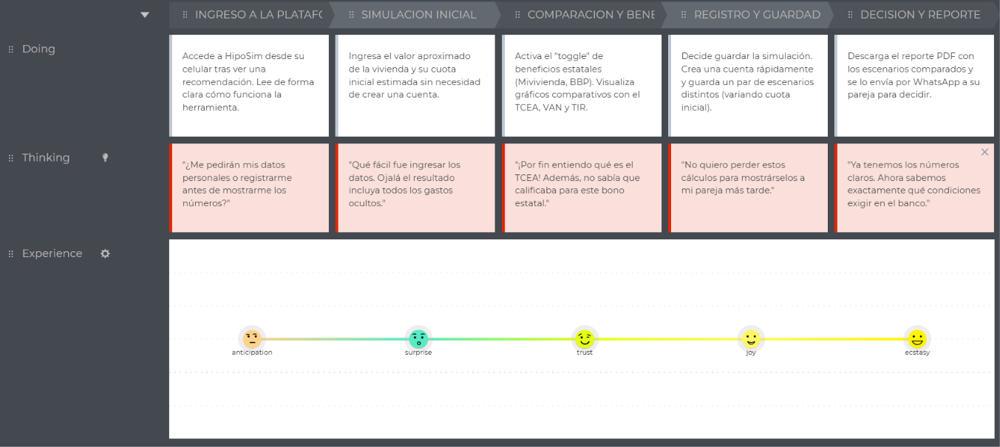
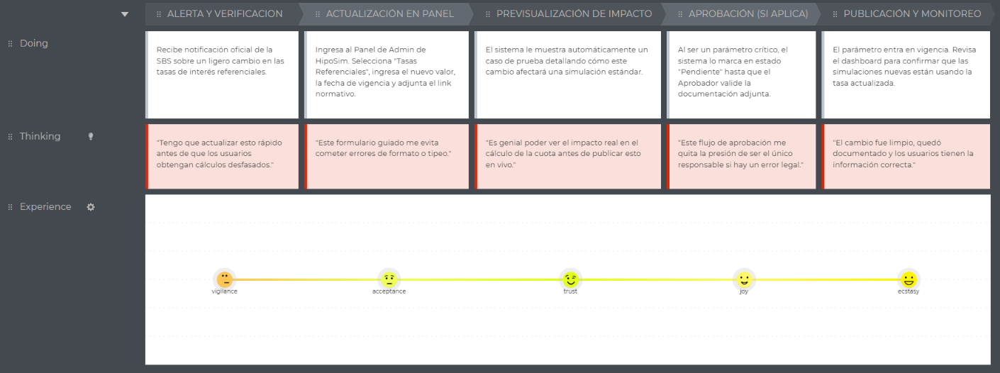
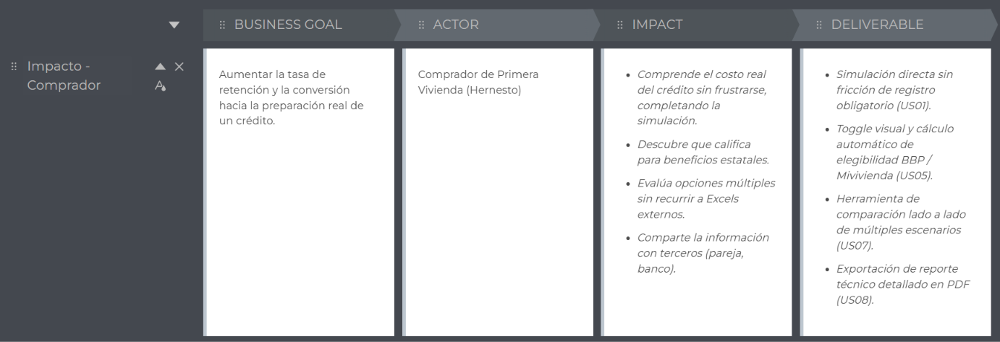
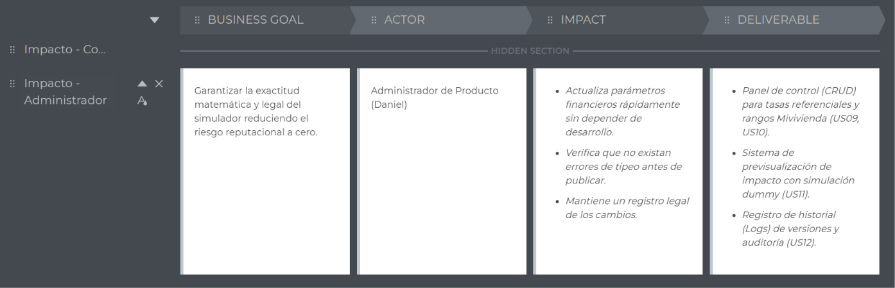

# **Chapter III: Requirements Specification**
## **3.1. To-Be Scenario Mapping**

El To-Be Scenario Mapping describe la experiencia futura e ideal de los usuarios al utilizar HipoSim. A diferencia del escenario actual (As-Is), donde predomina la frustración por la desinformación y el trabajo manual, este nuevo recorrido refleja un proceso fluido, centralizado y transparente. (Diseñado para ser modelado en UXPressia).

**Segmento 1: Comprador de Primera Vivienda (Hernesto)**

> 

**Segmento 2: Administrador de Producto (Daniel)**

> 

## 3.2. User Stories

**Product Backlog — User Stories & Epics**

| Epic / Story ID | Título | Descripción | Criterios de Aceptación | Relacionado con (Epic ID) |
| :--- | :--- | :--- | :--- | :--- |
| **EP01** | **Motor de Simulación Base** | Como usuario de la plataforma, Quiero calcular las cuotas de un crédito hipotecario, Para conocer el costo mensual según el método de amortización francés. | | |
| **EP02** | **Costo Efectivo y Beneficios** | Como usuario de la plataforma, Quiero visualizar el TCEA, VAN, TIR y aplicar subsidios estatales, Para conocer el costo real total de la operación financiera. | | |
| **EP03** | **Gestión de Escenarios** | Como usuario registrado, Quiero guardar, comparar y exportar simulaciones, Para discutir las opciones con mi familia sin perder los cálculos. | | |
| **EP04** | **Panel de Administración** | Como Administrador, Quiero gestionar tasas, rangos y beneficios estatales, Para mantener el simulador actualizado según la normativa oficial de forma segura. | | |
| **EP05** | **Autenticación y Perfiles** | Como usuario, Quiero registrarme y gestionar mi cuenta, Para mantener un historial seguro de mis simulaciones. | | |
| **EP06** | **Arquitectura y Tecnología** | Como equipo de desarrollo, Queremos implementar el backend, frontend y bases de datos, Para garantizar el correcto funcionamiento, seguridad y despliegue del sistema. | | |
| **US01** | Simular crédito base | Como Comprador, Quiero simular un crédito ingresando el precio y cuota inicial, Para ver mi cuota mensual sin tener que registrarme primero. | **Escenario 1: Simulación exitosa.** Given que el Comprador ingresa valores válidos (precio > 0, inicial > 10%); When presiona "Simular"; Then el sistema genera el cronograma de pagos bajo el método francés.  **Escenario 2: Datos insuficientes.** Given que el Comprador ingresa una cuota inicial menor al 10%; When intenta simular; Then el sistema muestra "La cuota inicial mínima es del 10%". | EP01 |
| **US02** | Ver cronograma de pagos | Como Comprador, Quiero visualizar el cronograma de pagos detallado, Para entender cómo se distribuye mi cuota entre capital e intereses mes a mes. | **Escenario 1: Vista de cronograma.** Given que se completó una simulación; When hace clic en "Ver detalle"; Then el sistema despliega una tabla con saldo inicial, amortización, interés y saldo final por cada mes. | EP01 |
| **US03** | Aplicar periodo de gracia | Como Comprador, Quiero añadir un periodo de gracia (total o parcial) a mi simulación, Para ver cómo afecta el pago de mis primeras cuotas y el costo total. | **Escenario 1: Gracia parcial.** Given que el usuario selecciona "Gracia parcial" de 3 meses; When genera el cálculo; Then el cronograma muestra solo el pago de intereses en los primeros 3 meses y reajusta la cuota desde el mes 4. | EP01 |
| **US04** | Visualizar TCEA, VAN y TIR | Como Comprador, Quiero ver el cálculo automático del TCEA, VAN y TIR en mi simulación, Para conocer el costo real efectivo más allá de la tasa nominal. | **Escenario 1: Cálculo exacto.** Given que la simulación es exitosa; When se muestran los resultados; Then el sistema destaca visualmente el porcentaje del TCEA incluyendo desgravamen y comisiones estimadas. | EP02 |
| **US05** | Integrar Bono del Buen Pagador | Como Comprador, Quiero activar el Bono del Buen Pagador con un solo clic, Para ver automáticamente cómo se reduce el monto a financiar si califico. | **Escenario 1: Bono aplicado.** Given que el valor de la vivienda está en el rango permitido; When activa el toggle de "Aplicar BBP"; Then el sistema deduce el monto del subsidio del capital a financiar y recalcula la cuota. | EP02 |
| **US06** | Guardar escenario de simulación | Como Usuario Registrado, Quiero guardar un escenario de simulación en mi perfil, Para no tener que volver a ingresar los datos en futuras sesiones. | **Escenario 1: Guardado exitoso.** Given que el usuario ha iniciado sesión; When presiona "Guardar Escenario" y le asigna un nombre; Then el sistema lo almacena en su base de datos personal. | EP03 |
| **US07** | Comparar escenarios guardados | Como Usuario Registrado, Quiero seleccionar y comparar dos o más escenarios guardados lado a lado, Para decidir qué configuración (ej. plazo o cuota inicial) me conviene más. | **Escenario 1: Comparativa en pantalla.** Given que tiene escenarios guardados; When selecciona dos simulaciones y presiona "Comparar"; Then el sistema muestra una tabla paralela destacando diferencias en cuota, TCEA y pago total. | EP03 |
| **US08** | Exportar reporte en PDF | Como Usuario Registrado, Quiero descargar un reporte en PDF de mis simulaciones o comparativas, Para enviárselo a mi pareja o llevarlo al banco. | **Escenario 1: Descarga exitosa.** Given que está visualizando un resultado; When presiona "Exportar PDF"; Then el sistema genera y descarga un archivo bien formateado con los gráficos y el cronograma. | EP03 |
| **US09** | Actualizar tasas referenciales | Como Administrador, Quiero actualizar las tasas de interés referenciales (TEA) en el sistema, Para que las nuevas simulaciones reflejen las condiciones actuales del mercado. | **Escenario 1: Actualización.** Given que ingresa una nueva TEA válida; When presiona "Actualizar"; Then el sistema guarda el nuevo valor con su fecha de vigencia. | EP04 |
| **US10** | Configurar rangos Mivivienda | Como Administrador, Quiero actualizar los topes y valores del programa Mivivienda y BBP, Para mantener la exactitud legal de los subsidios estatales calculados. | **Escenario 1: Modificación de tramos.** Given que la normativa cambia; When el Administrador ajusta los rangos de precios mínimos y máximos; Then el simulador evalúa la elegibilidad basándose en estos nuevos tramos. | EP04 |
| **US11** | Previsualizar impacto de parámetros | Como Administrador, Quiero previsualizar cómo afectará un cambio de tasa a una simulación estándar antes de publicarlo, Para evitar errores de tipeo que rompan el simulador. | **Escenario 1: Vista previa.** Given que el Administrador cambia un valor; When hace clic en "Previsualizar"; Then el sistema renderiza un cálculo dummy mostrando "Cuota anterior vs Cuota nueva". | EP04 |
| **US12** | Historial de auditoría de parámetros | Como Administrador, Quiero ver un historial completo de quién cambió qué parámetro y cuándo, Para mantener la trazabilidad frente a auditorías normativas. | **Escenario 1: Historial visible.** Given que selecciona un parámetro; When consulta el historial; Then ve una lista de versiones anteriores, responsable y documento de respaldo. | EP04 |
| **US13** | Iniciar sesión y registro | Como Comprador, Quiero registrarme usando mi correo o cuenta de Google, Para acceder a las funcionalidades de guardado y exportación. | **Escenario 1: Autenticación.** Given datos válidos; When envía el formulario de registro; Then el sistema crea la cuenta mediante JWT y redirige al dashboard personal. | EP05 |
| **TS01** | Configurar entorno de frontend | Como Developer, Quiero configurar el entorno de desarrollo con Vue y Tailwind CSS, Para asegurar una interfaz modular, moderna y responsive. | **Escenario 1: Setup inicial.** Given la inicialización del proyecto; When se ejecuta el servidor de desarrollo; Then la arquitectura base de componentes carga correctamente en el navegador. | EP06 |
| **TS02** | Implementar backend y base de datos | Como Developer, Quiero configurar el backend con C# (Minimal APIs) y migraciones en PostgreSQL mediante Entity Framework Core, Para asegurar una persistencia robusta y escalable. | **Escenario 1: Migración exitosa.** Given los modelos de datos definidos; When se ejecutan los comandos de migración; Then las tablas se crean en PostgreSQL respetando las relaciones y tipados estrictos. | EP06 |
| **TS03** | Generación dinámica de reportes | Como Developer, Quiero implementar un servicio que convierta el DOM de resultados en un archivo PDF optimizado, Para habilitar la exportación rápida sin sobrecargar el servidor. | **Escenario 1: Renderizado PDF.** Given el payload de simulación; When el cliente solicita el reporte; Then la librería procesa el blob y descarga el PDF estructurado. | EP06 |

---

## 3.3. Product Backlog

| Orden | User Story ID | Título | Descripción | Story Points |
| :---: | :--- | :--- | :--- | :---: |
| 1 | **US01** | Simular crédito base | Como Comprador, quiero simular un crédito ingresando el precio y cuota inicial, para ver mi cuota mensual sin tener que registrarme primero. | 5 |
| 2 | **US02** | Ver cronograma de pagos | Como Comprador, quiero visualizar el cronograma de pagos detallado, para entender cómo se distribuye mi cuota. | 3 |
| 3 | **US04** | Visualizar TCEA, VAN y TIR | Como Comprador, quiero ver el cálculo automático del TCEA, VAN y TIR, para conocer el costo real efectivo. | 8 |
| 4 | **US05** | Integrar Bono del Buen Pagador | Como Comprador, quiero activar el BBP con un solo clic, para ver automáticamente cómo se reduce el monto a financiar. | 5 |
| 5 | **US13** | Iniciar sesión y registro | Como Comprador, quiero registrarme usando mi correo, para acceder a las funcionalidades de guardado. | 3 |
| 6 | **US06** | Guardar escenario de simulación | Como Usuario Registrado, quiero guardar un escenario, para no tener que volver a ingresar los datos en futuras sesiones. | 3 |
| 7 | **US07** | Comparar escenarios guardados | Como Usuario Registrado, quiero comparar dos escenarios lado a lado, para decidir qué configuración me conviene. | 5 |
| 8 | **US08** | Exportar reporte en PDF | Como Usuario Registrado, quiero descargar un reporte en PDF de mis simulaciones, para enviárselo a mi pareja o al banco. | 5 |
| 9 | **US03** | Aplicar periodo de gracia | Como Comprador, quiero añadir un periodo de gracia, para ver cómo afecta el pago de mis primeras cuotas. | 5 |
| 10 | **US09** | Actualizar tasas referenciales | Como Administrador, quiero actualizar las tasas de interés referenciales (TEA), para que las simulaciones reflejen el mercado actual. | 3 |
| 11 | **US10** | Configurar rangos Mivivienda | Como Administrador, quiero actualizar los topes y valores del BBP, para mantener la exactitud legal de los subsidios. | 5 |
| 12 | **US11** | Previsualizar impacto de parámetros | Como Administrador, quiero previsualizar cómo afectará un cambio de tasa, para evitar errores de tipeo que rompan el simulador. | 3 |
| 13 | **US12** | Historial de auditoría de parámetros | Como Administrador, quiero ver un historial completo de cambios, para mantener la trazabilidad frente a auditorías. | 5 |
| 14 | **TS01** | Configurar entorno frontend | Como Developer, quiero configurar el entorno con Vue y Tailwind CSS, para asegurar una interfaz modular. | 3 |
| 15 | **TS02** | Implementar backend y base de datos | Como Developer, quiero configurar C# (.NET Core) y PostgreSQL, para asegurar la persistencia y reglas de negocio. | 5 |
| 16 | **TS03** | Generación dinámica de reportes | Como Developer, quiero implementar un servicio de exportación PDF, para habilitar la descarga rápida del reporte. | 5 |
## **3.4. Impact Mapping**

El Impact Mapping vincula los objetivos principales del negocio con el cambio de comportamiento esperado en nuestros segmentos de usuarios y las funcionalidades (Entregables) necesarias para lograrlo.

**Impact Map - Segmento 1: Comprador de Primera Vivienda**

> 

**Impact Map - Segmento 2: Administrador de Producto**

> 
