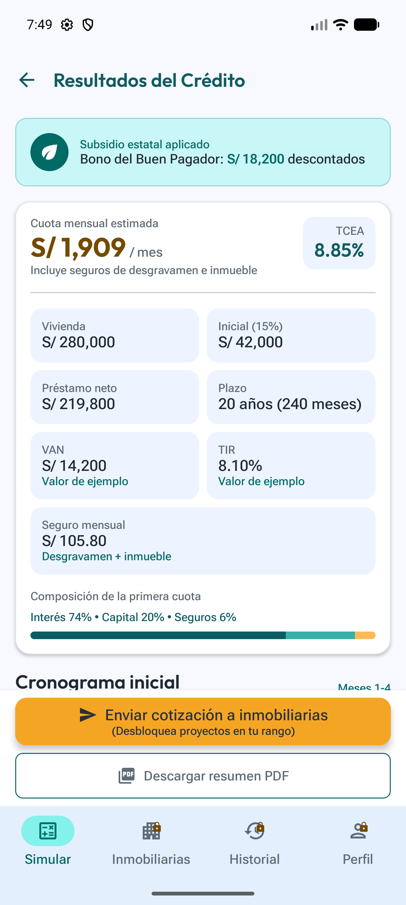
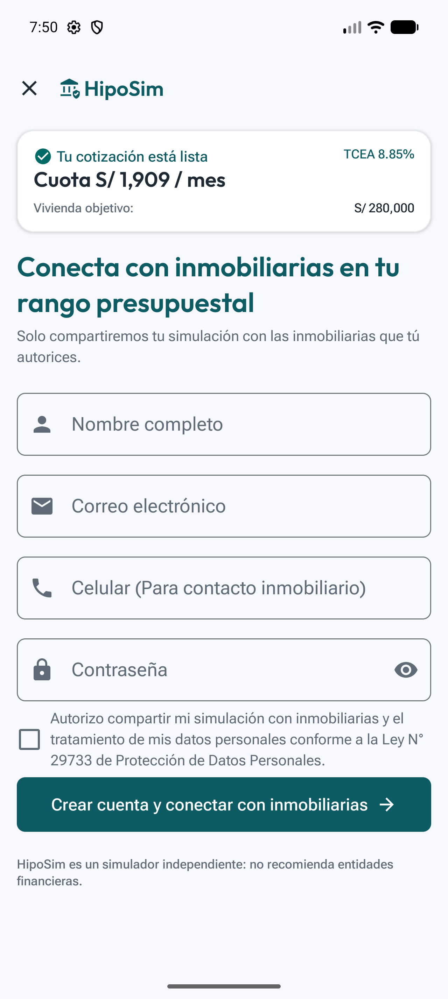

# **Chapter V: Product Implementation**

<div style="text-align: justify; line-height: 1.6;">

Este capítulo presenta la estrategia de implementación y despliegue de **HipoSim**, un simulador hipotecario web y móvil, independiente y dirigido a compradores de primera vivienda en el Perú. La implementación transforma los requerimientos del Capítulo III y el diseño del producto establecido en el Capítulo IV en un conjunto de productos digitales: una Landing Page pública, una Aplicación Web Frontend responsiva, una Aplicación Móvil Nativa, una API RESTful y una base de datos relacional.

También se establecen el entorno de desarrollo, las prácticas de gestión del código fuente, las convenciones de programación, la configuración de despliegue, los Sprint Backlogs, las evidencias de implementación, la documentación del servicio y los criterios de colaboración del equipo. Cuando los capítulos anteriores no proporcionan un enlace de repositorio, despliegue, commit o video, se conserva un campo de evidencia claramente identificado para que el equipo lo complete después de publicar el artefacto correspondiente.

</div>

---

## **5.1. Software Configuration Management**

<div style="text-align: justify; line-height: 1.6;">

La Gestión de la Configuración del Software define las herramientas, convenciones, entornos y prácticas de control de versiones que permiten al equipo construir HipoSim de manera consistente y trazable. Estas decisiones abarcan la gestión del proyecto, requerimientos, diseño UX/UI, desarrollo, pruebas, documentación y despliegue.

</div>

### **5.1.1. Software Development Environment Configuration**

<div style="text-align: justify; line-height: 1.6;">

Las siguientes herramientas soportan el ciclo de vida de HipoSim. La selección es coherente con los capítulos I, III y IV: Vue y Vite para el cliente web; HTML5, CSS3 y JavaScript para la Landing Page; C# y ASP.NET Core para la API RESTful; Entity Framework Core para la persistencia; y PostgreSQL como base de datos relacional.

</div>

<table style="width:100%; border-collapse:collapse; margin:16px 0;">
<thead><tr style="background-color:#0E5C63; color:#FFFFFF;"><th style="border:1px solid #B8C2CC; padding:10px;">Actividad</th><th style="border:1px solid #B8C2CC; padding:10px;">Herramienta</th><th style="border:1px solid #B8C2CC; padding:10px;">Propósito en HipoSim</th><th style="border:1px solid #B8C2CC; padding:10px;">Referencia</th></tr></thead>
<tbody>
<tr><td style="border:1px solid #B8C2CC; padding:9px;">Gestión del proyecto</td><td style="border:1px solid #B8C2CC; padding:9px;">Jira</td><td style="border:1px solid #B8C2CC; padding:9px;">Gestionar épicas, historias de usuario, historias técnicas, Sprint Backlogs, prioridades, responsables y progreso.</td><td style="border:1px solid #B8C2CC; padding:9px;"><a href="https://www.atlassian.com/software/jira">Sitio oficial</a></td></tr>
<tr style="background-color:#F7FAFC;"><td style="border:1px solid #B8C2CC; padding:9px;">Gestión de requerimientos</td><td style="border:1px solid #B8C2CC; padding:9px;">Jira y Markdown</td><td style="border:1px solid #B8C2CC; padding:9px;">Mantener la trazabilidad entre backlog, criterios de aceptación, implementación y documentación.</td><td style="border:1px solid #B8C2CC; padding:9px;"><a href="https://www.markdownguide.org/">Markdown Guide</a></td></tr>
<tr><td style="border:1px solid #B8C2CC; padding:9px;">Diseño UX/UI</td><td style="border:1px solid #B8C2CC; padding:9px;">Figma</td><td style="border:1px solid #B8C2CC; padding:9px;">Crear wireframes, mock-ups, wireflows, flujos de usuario y prototipos web y móviles.</td><td style="border:1px solid #B8C2CC; padding:9px;"><a href="https://www.figma.com/">Sitio oficial</a></td></tr>
<tr style="background-color:#F7FAFC;"><td style="border:1px solid #B8C2CC; padding:9px;">Arquitectura y modelado</td><td style="border:1px solid #B8C2CC; padding:9px;">Structurizr y Lucidchart</td><td style="border:1px solid #B8C2CC; padding:9px;">Formalizar los diagramas C4, de clases y de base de datos.</td><td style="border:1px solid #B8C2CC; padding:9px;"><a href="https://structurizr.com/">Structurizr</a> / <a href="https://www.lucidchart.com/">Lucidchart</a></td></tr>
<tr><td style="border:1px solid #B8C2CC; padding:9px;">Control de versiones</td><td style="border:1px solid #B8C2CC; padding:9px;">Git y GitHub</td><td style="border:1px solid #B8C2CC; padding:9px;">Registrar cambios, aplicar GitFlow, revisar contribuciones y conectar los repositorios con los servicios de despliegue.</td><td style="border:1px solid #B8C2CC; padding:9px;"><a href="https://git-scm.com/">Git</a> / <a href="https://github.com/">GitHub</a></td></tr>
<tr style="background-color:#F7FAFC;"><td style="border:1px solid #B8C2CC; padding:9px;">Desarrollo web</td><td style="border:1px solid #B8C2CC; padding:9px;">VS Code, Node.js, Vue 3, Vite y PrimeVue</td><td style="border:1px solid #B8C2CC; padding:9px;">Desarrollar la aplicación web modular y responsiva respetando el sistema visual del Capítulo IV.</td><td style="border:1px solid #B8C2CC; padding:9px;"><a href="https://vuejs.org/">Vue</a> / <a href="https://vite.dev/">Vite</a></td></tr>
<tr><td style="border:1px solid #B8C2CC; padding:9px;">Landing Page</td><td style="border:1px solid #B8C2CC; padding:9px;">HTML5, CSS3, JavaScript y GitHub Pages</td><td style="border:1px solid #B8C2CC; padding:9px;">Implementar y publicar la presentación pública, el simulador básico, los beneficios, los términos y el llamado a la acción.</td><td style="border:1px solid #B8C2CC; padding:9px;"><a href="https://developer.mozilla.org/">MDN Web Docs</a></td></tr>
<tr style="background-color:#F7FAFC;"><td style="border:1px solid #B8C2CC; padding:9px;">Backend</td><td style="border:1px solid #B8C2CC; padding:9px;">Visual Studio/Rider, .NET, C#, ASP.NET Core y Entity Framework Core</td><td style="border:1px solid #B8C2CC; padding:9px;">Implementar la API, autenticación, cálculos financieros, beneficios, reportes, administración y persistencia.</td><td style="border:1px solid #B8C2CC; padding:9px;"><a href="https://dotnet.microsoft.com/">.NET</a></td></tr>
<tr><td style="border:1px solid #B8C2CC; padding:9px;">Base de datos</td><td style="border:1px solid #B8C2CC; padding:9px;">PostgreSQL y pgAdmin</td><td style="border:1px solid #B8C2CC; padding:9px;">Almacenar usuarios, simulaciones, cronogramas, indicadores, beneficios, comparaciones, reportes y parámetros.</td><td style="border:1px solid #B8C2CC; padding:9px;"><a href="https://www.postgresql.org/">PostgreSQL</a></td></tr>
<tr style="background-color:#F7FAFC;"><td style="border:1px solid #B8C2CC; padding:9px;">Pruebas y documentación de API</td><td style="border:1px solid #B8C2CC; padding:9px;">Swagger/OpenAPI y Postman</td><td style="border:1px solid #B8C2CC; padding:9px;">Documentar endpoints y verificar solicitudes, respuestas, validaciones y autorizaciones.</td><td style="border:1px solid #B8C2CC; padding:9px;"><a href="https://swagger.io/specification/">OpenAPI</a></td></tr>
<tr><td style="border:1px solid #B8C2CC; padding:9px;">Documentación</td><td style="border:1px solid #B8C2CC; padding:9px;">Markdown, HTML y GitHub</td><td style="border:1px solid #B8C2CC; padding:9px;">Mantener el informe técnico versionado y preparado para exportarse a PDF.</td><td style="border:1px solid #B8C2CC; padding:9px;"><a href="https://docs.github.com/en/get-started/writing-on-github">GitHub Docs</a></td></tr>
</tbody></table>

#### **Local Development Environment Baseline**

```text
Node.js: versión LTS aprobada por el equipo
Gestor de paquetes: npm
Frontend: Vue 3 + Vite + PrimeVue (tema Material)
Backend: versión de .NET SDK aprobada por el equipo + ASP.NET Core
ORM: Entity Framework Core
Base de datos: PostgreSQL
Control de versiones: Git
Plataforma remota: GitHub
Contrato de API: OpenAPI
```

### **5.1.2. Source Code Management**

<div style="text-align:justify; line-height:1.6;">

GitHub será la plataforma de control de versiones. Cada producto digital tendrá un repositorio independiente para administrar su historial, incidencias, despliegue y versiones. El repositorio de la API RESTful también incluirá las pruebas unitarias y de integración/aceptación.

</div>

| Producto | Nombre sugerido del repositorio | URL |
|:--|:--|:--|
| Landing Page | `hiposim-LandingPage` | [https://github.com/auracode-exp-design-1asi0732-2620-9104/hiposim-LandingPage](https://github.com/auracode-exp-design-1asi0732-2620-9104/hiposim-LandingPage) |
| Aplicación Web Frontend | `hiposim-frontend` | *URL* |
| Aplicación Móvil Nativa | `hiposim-mobile` | *URL* |
| API RESTful y pruebas | `hiposim-platform` | *URL* |

#### **GitFlow Workflow**

- `main`: contiene versiones estables, revisadas y desplegables en producción.
- `develop`: integra las funcionalidades terminadas para la siguiente versión.
- `feature/<alcance>-<descripcion-corta>`: implementa una historia; ejemplo: `feature/us01-mortgage-simulation`.
- `release/<mayor>.<menor>.<parche>`: estabiliza una versión candidata; ejemplo: `release/1.0.0`.
- `hotfix/<mayor>.<menor>.<parche>-<descripcion>`: corrige un defecto urgente; ejemplo: `hotfix/1.0.1-tcea-rounding`.

<div style="text-align:justify; line-height:1.6;">

Las ramas `feature` nacen desde `develop` y regresan mediante Pull Request. Las ramas `release` nacen desde `develop` y se fusionan con `main` y `develop`. Las ramas `hotfix` nacen desde `main` y también regresan a ambas ramas permanentes. No se permiten cambios directos en `main`. Las versiones emplean **Versionado Semántico** (`MAYOR.MENOR.PARCHE`) y etiquetas como `v1.0.0`.

Los commits siguen **Conventional Commits**:

</div>

```text
<tipo>(<alcance>): <descripción breve>
```

```text
feat(simulation): calculate mortgage installments with French amortization
feat(benefits): evaluate Good Payer Bonus eligibility
fix(auth): prevent access with an expired token
docs(api): document simulation endpoints
test(financial-engine): add TCEA calculation cases
```

### **5.1.3. Source Code Style Guide & Conventions**

<div style="text-align:justify; line-height:1.6;">

Los identificadores del código y los elementos técnicos se escribirán en inglés. El contenido visible para el usuario se gestionará con internacionalización (i18n) en español (es_419) e inglés (en_US), porque HipoSim se dirige a compradores peruanos y el curso exige ambos idiomas. El código priorizará claridad, funciones breves, nombres del dominio, separación de responsabilidades y ausencia de reglas duplicadas.

</div>

| Tecnología | Convenciones principales | Referencia |
|:--|:--|:--|
| HTML5 | Elementos semánticos, etiquetas en minúscula, textos `alt` significativos, etiquetas asociadas a campos e indentación consistente. | [Google HTML/CSS Style Guide](https://google.github.io/styleguide/htmlcssguide.html) |
| CSS | Enfoque mobile-first, tokens reutilizables, clases kebab-case, ausencia de valores mágicos y contraste WCAG AA. | [Google HTML/CSS Style Guide](https://google.github.io/styleguide/htmlcssguide.html) |
| JavaScript | `const` por defecto, camelCase para variables y funciones, PascalCase para clases, igualdad estricta y async/await. | [Google JavaScript Style Guide](https://google.github.io/styleguide/jsguide.html) |
| Vue | Componentes PascalCase de varias palabras, un componente por archivo, props explícitas y lógica de negocio en servicios/composables. | [Vue Style Guide](https://vuejs.org/style-guide/) |
| C# / ASP.NET Core | PascalCase para miembros públicos, camelCase para parámetros, sufijo Async, inyección de dependencias y validación de DTO. | [C# Coding Conventions](https://learn.microsoft.com/dotnet/csharp/fundamentals/coding-style/coding-conventions) |
| Gherkin | Un comportamiento por escenario, pasos Dado que-Cuando-Entonces declarativos y lenguaje del negocio. | [Gherkin Reference](https://cucumber.io/docs/gherkin/) |

| Elemento | Convención | Ejemplo |
|:--|:--|:--|
| Componente Vue | PascalCase | `SimulationResults.vue` |
| Variable/función JavaScript | camelCase | `calculateMonthlyPayment` |
| Clase/interfaz C# | PascalCase / prefijo `I` | `SimulationService`, `ISimulationRepository` |
| Recurso REST | Sustantivo plural en minúscula | `/api/simulations` |
| Tabla de base de datos | snake_case plural | `simulation_reports` |
| Variable de entorno | UPPER_SNAKE_CASE | `DATABASE_CONNECTION_STRING` |
| Prueba | Nombre orientado al comportamiento | `Calculate_WhenInputIsValid_ReturnsSchedule` |

### **5.1.4. Software Deployment Configuration**

<div style="text-align:justify; line-height:1.6;">

Cada producto debe poder desplegarse desde su repositorio. El Landing Page ya se publica en GitHub Pages; los proveedores y enlaces públicos de los demás productos se completarán cuando el equipo los publique. La siguiente configuración describe el flujo exigido para cada producto.

</div>

#### **Landing Page Deployment**

1. Obtener la última versión aprobada de `main`.
2. Validar HTML, CSS, enlaces, comportamiento responsivo, metadatos y accesibilidad.
3. Publicar los recursos en GitHub Pages desde la rama principal del repositorio.
4. Verificar que GitHub Pages sirva el sitio mediante HTTPS.
5. Verificar Inicio, Producto, Beneficios, Términos y **Simular ahora**.

#### **Frontend Web Application Deployment**

1. Instalar dependencias con `npm ci`.
2. Configurar la URL de la API mediante una variable de entorno.
3. Ejecutar linting, pruebas automatizadas y `npm run build`.
4. Publicar el directorio `dist` en el servicio seleccionado.
5. Verificar rutas, autenticación, simulación, historial, comparación y breakpoints.

#### **RESTful API and Database Deployment**

1. Restaurar dependencias .NET y compilar en modo Release.
2. Ejecutar pruebas unitarias y de integración.
3. Aprovisionar PostgreSQL y proteger la cadena de conexión.
4. Aplicar las migraciones de Entity Framework Core de forma controlada.
5. Publicar la API ASP.NET Core en el servicio seleccionado.
6. Configurar CORS, HTTPS, tokens seguros y registros centralizados.
7. Verificar el endpoint de salud y la documentación OpenAPI.

#### **Native Mobile Application Deployment**

1. Configurar el endpoint de producción y los identificadores de la aplicación.
2. Generar builds firmados de Android (y de iOS, si el alcance lo incluye) con credenciales protegidas.
3. Probar tamaños de dispositivo y versiones soportadas.
4. Distribuir una compilación de prueba interna antes de enviarla a las tiendas.
5. Completar metadatos, privacidad, capturas y notas de versión.

| Producto | URL de producción/distribución | Estado |
|:--|:--|:--|
| Landing Page | [https://auracode-exp-design-1asi0732-2620-9104.github.io/hiposim-LandingPage/](https://auracode-exp-design-1asi0732-2620-9104.github.io/hiposim-LandingPage/) | Publicado en GitHub Pages. |
| Aplicación Web Frontend | *Pendiente* | Completar después del despliegue. |
| API RESTful | *Pendiente* | Completar después del despliegue. |
| Aplicación Móvil Nativa | [https://github.com/auracode-exp-design-1asi0732-2620-9104/hiposim-app-mobile](https://github.com/auracode-exp-design-1asi0732-2620-9104/hiposim-app-mobile) | Código en la rama `develop`; sin despliegue ni distribución en esta entrega. |

<div style="page-break-before:always;"></div>

## **5.2. Product Implementation & Deployment**

<div style="text-align:justify; line-height:1.6;">

La implementación se organiza mediante el Product Backlog del Capítulo III, gestionado en Jira. La secuencia comienza por el Landing Page, que permite a un visitante estimar su cuota y su TCEA sin registrarse, y por las bases del frontend web y de la aplicación móvil; después incorpora el backend, la simulación completa, la gestión de escenarios y la conexión opcional con inmobiliarias, dejando las funciones administrativas para una etapa posterior.

</div>

### **5.2.1. Sprint Backlogs**

<div style="text-align:justify; line-height:1.6;">

El Product Backlog del Capítulo III se gestiona en Jira, donde cada historia se descompone en tasks. El Sprint 1 concentra el Landing Page y las bases del frontend web y de la aplicación móvil. Los Sprints 2 a 4 se planifican de forma tentativa y se ajustarán según el resultado de cada Sprint Review.

</div>

#### **Sprint 1 - Landing Page and Foundations**

| Campo | Detalle |
|:--|:--|
| Sprint | Sprint 1 |
| Sprint Goal | Nuestro enfoque es publicar el Landing Page con un simulador básico, beneficios estatales, información legal y cambio de idioma, y dejar listas las bases del frontend web y de la aplicación móvil. Creemos que entrega claridad sobre el costo real del crédito a los compradores primerizos. Se confirmará cuando un visitante obtenga su cuota mensual y su TCEA estimada, sin registrarse, en el sitio publicado en GitHub Pages. |
| Velocity | 26 Story Points (estimación inicial, sin historial de Sprints previos). |
| Suma de Story Points | **26** |
| Elementos planificados | TS04, US14, US15, US16, US17, US18, US19, US20, TS01, SP03 y 4 tasks de diseño de mockups. |
| Fecha, hora, ubicación y asistentes | *Pendiente: completar con el registro real del Sprint Planning.* |

**Sprint Backlog 1**

> Captura del Board del Sprint 1 en Jira: _pendiente de agregar_.
>
> URL público del Board: _pendiente de agregar_.

| ID | Historia o elemento | SP | Work-Items / Tasks |
|:---:|:--|---:|:--|
| TS04 | Configurar y publicar el Landing Page | 3 | 1. Estructurar el repositorio y las secciones del Landing Page<br>2. Aplicar los tokens de estilo del Design System (colores y tipografía)<br>3. Agregar atributos ARIA y validar el contraste WCAG AA<br>4. Publicar en GitHub Pages y verificar la URL pública |
| US14 | Ver propuesta de valor | 2 | 1. Redactar el contenido de propuesta de valor y comparación con simuladores bancarios<br>2. Maquetar la sección de inicio y la navegación (escritorio y móvil) |
| US15 | Simular crédito sin registro desde el Landing Page | 5 | 1. Diseñar los controles del simulador básico<br>2. Implementar el cálculo por método francés en JavaScript<br>3. Implementar la aplicación del Bono del Buen Pagador<br>4. Implementar la vista del cronograma completo<br>5. Validar los resultados contra los casos de prueba de AutoFinance Pro |
| US16 | Conocer beneficios estatales | 2 | 1. Redactar el contenido de beneficios estatales<br>2. Maquetar la sección de beneficios |
| US17 | Consultar Términos y Condiciones y Privacidad | 2 | 1. Redactar los Términos y Condiciones y la política de privacidad (Ley N° 29733)<br>2. Publicar las páginas y enlazarlas en el pie del Landing Page |
| US18 | Consultar preguntas frecuentes | 2 | 1. Redactar las preguntas frecuentes<br>2. Implementar la sección de preguntas frecuentes |
| US19 | Contactar al equipo de HipoSim | 2 | 1. Diseñar el formulario de contacto<br>2. Implementar la validación y el envío de la consulta |
| US20 | Cambiar el idioma del sitio | 3 | 1. Definir los diccionarios de textos en español (es_419) e inglés (en_US)<br>2. Implementar el selector de idioma y la carga de textos<br>3. Conservar el idioma elegido al navegar entre secciones<br>4. Actualizar el atributo lang del documento y verificar los textos traducidos |
| TS01 | Configurar entorno de frontend | 3 | 1. Crear el proyecto Vue con Vite<br>2. Instalar y configurar PrimeVue con el tema Material y los tokens de HipoSim<br>3. Definir la estructura de carpetas y el enrutamiento |
| SP03 | Definir la tecnología de la app móvil nativa | 2 | 1. Comparar las opciones de tecnología móvil nativa<br>2. Construir un prototipo mínimo de una pantalla y documentar la decisión en un ADR |
| DS | Diseño de mockups (independientes de una historia) | - | 1. Diseñar mockup móvil del registro contextual (US13)<br>2. Diseñar mockup móvil de resultados y conexión con inmobiliarias (US21)<br>3. Diseñar mockup web de la bandeja de leads (US23)<br>4. Diseñar mockup web de la ficha del lead (US24) |

El responsable y el estado de cada task se registran en Jira.

#### **Sprints 2 to 4 - Tentative Planning**

| Sprint | Story Points | Elementos | Enfoque |
|:--|:-:|:--|:--|
| Sprint 2 | 33 | SP02, TS02, TS06, TS05, US01, US04, US05 | Backend y base de datos, endpoint de simulación documentado, simulación con indicadores y Bono del Buen Pagador. |
| Sprint 3 | 29 | US02, US13, TS07, US06, US07, SP01, TS03, US08 | Cronograma, autenticación, escenarios guardados y reporte PDF. |
| Sprint 4 | 26 | US21, US22, TS08, US23, US24, US25 | Conexión opcional con inmobiliarias y portal del Asesor. |
| Sin Sprint asignado | 21 | US03, US09, US10, US11, US12 | Periodo de gracia y administración de parámetros, con prioridad baja. |

La implementación del backend y de la base de datos (TS02) no forma parte de esta entrega; se planifica a partir del Sprint 2.

### **5.2.2. Implemented Landing Page Evidence**

<div style="text-align:justify; line-height:1.6;">

El Landing Page comunica la propuesta independiente y transparente de HipoSim e incluye un simulador básico interactivo (valor de la vivienda, cuota inicial y plazo) que calcula la cuota mensual, la TCEA estimada y el préstamo neto sin registro, con la opción de aplicar el Bono del Buen Pagador. Su navegación es **Inicio**, **Producto**, **Beneficios** y **Preguntas**, con un selector de idioma (ES/EN) y los llamados **Ingresar** y **Simular ahora**. Incluye además las secciones de preguntas frecuentes, contacto, Términos y Condiciones y Política de Privacidad (Ley N° 29733), que aclara que la conexión con inmobiliarias solo ocurre si el usuario la autoriza. Está construido con HTML5, CSS3 y JavaScript, con Tailwind CSS como utilidad de estilos exclusivamente en el Landing Page, mientras que la Aplicación Web usa PrimeVue. Emplea verde azulado (`#0E5C63`), turquesa (`#3AAFA9`), ámbar (`#F5A524`), las tipografías Outfit (títulos) y Roboto Flex (cuerpo), espaciado basado en múltiplos de 8 px y diseño responsivo.

</div>

| Evidencia | Registro requerido |
|:--|:--|
| Repositorio | [https://github.com/auracode-exp-design-1asi0732-2620-9104/hiposim-LandingPage](https://github.com/auracode-exp-design-1asi0732-2620-9104/hiposim-LandingPage) |
| Despliegue | [https://auracode-exp-design-1asi0732-2620-9104.github.io/hiposim-LandingPage/](https://auracode-exp-design-1asi0732-2620-9104.github.io/hiposim-LandingPage/) |
| Historias relacionadas | TS04, US14, US15, US16, US17, US18, US19 y US20 (Sprint 1) |
| Versión | *Pendiente* |
| Verificación | Navegación, metadatos, enlaces, responsividad, accesibilidad (landmarks y atributos ARIA), cambio de idioma ES/EN con persistencia en `localStorage` y CTA. |
| Alcance y limitaciones | El formulario de contacto valida los campos, pero su envío es simulado (sin backend). El cálculo del simulador usa una TCEA referencial fija de 8.85%. El idioma inicial es español y el inglés se activa con el selector; queda por decidir el idioma por defecto (el curso indica en_US). |

<div align="center">
  
  <p><em>Figura 1. Landing Page implementada de HipoSim (escritorio).</em></p>
</div>

<div align="center">
  
  <p><em>Figura 2. Landing Page implementada de HipoSim (móvil).</em></p>
</div>

### **5.2.3. Implemented Frontend-Web Application Evidence**

<div style="text-align:justify; line-height:1.6;">

La Aplicación Web responsiva se diseña en dos frentes: el recorrido del Comprador (datos del cliente, vivienda, parámetros del crédito y resultados) y el portal del Asesor de inmobiliaria, donde se gestionan los leads que el Comprador autorizó compartir. Para esta entrega se presentan los mockups de la bandeja de leads y de la ficha del lead (Capítulo IV) y la configuración del entorno (TS01); la implementación funcional continúa a partir del Sprint 2.

</div>

| Módulo | Requerimientos | Evidencia esperada |
|:--|:--|:--|
| Autenticación | US13, US22 | Registro e inicio de sesión de Comprador y Asesor, y rutas protegidas por rol. |
| Asistente de simulación | US01, US03 | Validación, cuatro pasos, monto, plazo y gracia. |
| Resultados financieros | US02, US04, US05 | Cuota, cronograma, TCEA, VAN, TIR y BBP. |
| Historial | US06 | Lista de simulaciones y filtros de fecha y tipo. |
| Comparación | US07 | Dos o tres escenarios en paralelo. |
| Reportes | US08, TS03 | PDF con indicadores y cronograma. |
| Conexión con inmobiliarias | US21 | Envío de la simulación solo con el consentimiento del Comprador. |
| Portal del Asesor | US23, US24, US25 | Bandeja de leads, ficha del lead, cambio de estado y notas de seguimiento. |
| Administración | US09-US12 | Parámetros, previsualización e historial (prioridad baja, etapa posterior). |

| Evidencia | Registro requerido |
|:--|:--|
| Repositorio | *PENDIENTE.* |
| Despliegue | *PENDIENTE* |
| Commits/Pull Requests | *Pendiente: identificadores por Sprint.* |
| Capturas | *Pendiente: mockups de la bandeja y la ficha del lead (Capítulo IV) y pantallas implementadas por Sprint.* |

### **5.2.4. Implemented Native-Mobile Application Evidence**

<div style="text-align:justify; line-height:1.6;">

La aplicación móvil Android nativa se desarrolla con Kotlin, Jetpack Compose y Material 3, con Hilt, Navigation Compose y ViewModel con StateFlow (decisión documentada en el ADR 0001, spike SP03). Esta entrega incluye la pantalla de Resultados del Crédito (cuota, TCEA, Bono del Buen Pagador, composición de la primera cuota y cronograma inicial, con datos de ejemplo), el Registro Contextual con consentimiento obligatorio de la Ley N° 29733, una sesión simulada en memoria y la hoja para enviar la cotización a inmobiliarias, que exige registro. Aún no hay backend, generación de PDF, inicio de sesión propio, historial ni comparación de escenarios, que se incorporan en los Sprints siguientes. Android utiliza patrones Material, navegación inferior y un botón flotante para una nueva simulación; iOS respeta áreas seguras, navegación nativa y hojas modales, sin perder la identidad visual de HipoSim.

</div>

| Evidencia | Registro requerido |
|:--|:--|
| Repositorio | [https://github.com/auracode-exp-design-1asi0732-2620-9104/hiposim-app-mobile](https://github.com/auracode-exp-design-1asi0732-2620-9104/hiposim-app-mobile) (rama `develop`, integrada mediante el Pull Request #1) |
| Distribución | Sin despliegue en esta entrega; se ejecuta en emulador o dispositivo Android desde el código fuente. |
| Plataformas | Android (minSdk 26, targetSdk 36); iOS según la decisión del spike SP03. |
| Historias relacionadas | SP03 (Sprint 1) y avance de US13 y US21 (previstas para Sprints posteriores). |
| Flujos | Resultados de la simulación, registro contextual, sesión simulada y bloqueo de la conexión con inmobiliarias hasta registrarse. |
| Calidad | ktlint y lint sin errores, 35 pruebas unitarias, 4 pruebas de interfaz en emulador y flujo de integración continua en GitHub Actions. |
| Idioma | Textos en recursos, inglés por defecto y español (es-419). |

<div align="center">
  
  
  <p><em>Figura 3. Resultados del crédito y Registro Contextual de la aplicación Android.</em></p>
</div>

### **5.2.5. Implemented RESTful API and/or Serverless Backend Evidence**

<div style="text-align:justify; line-height:1.6;">

HipoSim utiliza una API RESTful con ASP.NET Core y PostgreSQL mediante Entity Framework Core. La API centraliza autenticación, simulaciones, escenarios, reportes, beneficios, leads y parámetros administrativos. El Financial Engine aísla amortización francesa, conversión de tasas, periodos de gracia, VAN, TIR y TCEA; el Benefits Engine evalúa BBP y Nuevo Crédito Mivivienda. La implementación del backend y de la base de datos (TS02) está planificada para el Sprint 2 y no forma parte de esta entrega.

</div>

| Componente | Responsabilidad |
|:--|:--|
| `AuthController` / `AuthService` | Registrar y autenticar Compradores, Asesores y Administradores; aplicar autorización por roles. |
| `SimulationController` / `SimulationService` | Validar entradas, invocar motores y persistir resultados. |
| `ScenarioController` / `ScenarioService` | Guardar, recuperar y comparar escenarios. |
| `ReportController` / `ReportGenerationService` | Crear PDF y enlaces de solo lectura. |
| `LeadController` / `LeadService` | Registrar los leads autorizados por el Comprador y permitir al Asesor consultarlos, cambiar su estado y registrar notas de seguimiento. |
| `AdminController` / `AdminParameterService` | Gestionar tasas, BBP, rangos, métricas e historial. |
| `FinancialEngine` | Calcular amortización, tasas, gracia, VAN, TIR y TCEA. |
| `BenefitsEngine` | Determinar elegibilidad y recalcular el monto financiado. |
| Repositorios | Persistir agregados en PostgreSQL. |

| Evidencia | Registro requerido |
|:--|:--|
| Repositorio | *PENDIENTE* |
| Despliegue | *PENDIENTE* |
| Migración | *PENDIENTE* |
| Pruebas | *PENDIENTE* |
| Salud | *PENDIENTE* |

### **5.2.6. RESTful API Documentation**

<div style="text-align:justify; line-height:1.6;">

La API debe publicar un contrato OpenAPI y una interfaz Swagger UI. El diseño siguiente deriva de las historias y arquitectura de los capítulos III y IV. Las rutas y esquemas finales deberán coincidir con la implementación.

</div>

| Método | Recurso | Propósito | Requerimiento |
|:--:|:--|:--|:--:|
| `POST` | `/api/auth/register` | Registrar una cuenta de Comprador. | US13, TS07 |
| `POST` | `/api/auth/login` | Autenticar Comprador, Asesor o Administrador. | US13, US22, TS07 |
| `POST` | `/api/simulations` | Calcular una simulación. | US01, US03, US04, US05, TS06 |
| `GET` | `/api/simulations/{id}` | Obtener una simulación autorizada. | US02, US06 |
| `GET` | `/api/simulations` | Listar simulaciones guardadas. | US06 |
| `POST` | `/api/comparisons` | Comparar dos o tres escenarios. | US07 |
| `GET` | `/api/simulations/{id}/report` | Generar u obtener el PDF. | US08, TS03 |
| `POST` | `/api/leads` | Compartir la simulación con inmobiliarias con el consentimiento del Comprador. | US21, TS08 |
| `GET` | `/api/leads` | Listar los leads de la inmobiliaria del Asesor. | US23, TS08 |
| `GET` | `/api/leads/{id}` | Obtener la ficha de un lead. | US24 |
| `PATCH` | `/api/leads/{id}/status` | Cambiar el estado de un lead. | US25, TS08 |
| `POST` | `/api/leads/{id}/notes` | Registrar una nota de seguimiento. | US25 |
| `GET` | `/api/admin/parameters` | Consultar parámetros vigentes. | US09, US10 |
| `PUT` | `/api/admin/parameters/{key}` | Actualizar un parámetro autorizado. | US09, US10 |
| `POST` | `/api/admin/parameters/{key}/preview` | Previsualizar un cambio. | US11 |
| `GET` | `/api/admin/parameters/{key}/history` | Consultar historial de auditoría. | US12 |
| `GET` | `/health` | Verificar disponibilidad. | TS02 |

#### **Representative Simulation Request**

```json
{
  "propertyPrice": 280000.00,
  "downPayment": 42000.00,
  "annualEffectiveRate": 0.085,
  "termInMonths": 240,
  "gracePeriodMonths": 0,
  "graceType": "none",
  "applyGoodPayerBonus": true
}
```

#### **Representative Simulation Response**

```json
{
  "simulationId": "generated-id",
  "financedAmount": 219800.00,
  "monthlyInstallment": 1909.00,
  "tcea": 0.0885,
  "benefit": {
    "name": "Good Payer Bonus",
    "eligible": true,
    "appliedAmount": 18200.00
  },
  "amortizationSchedule": []
}
```

La respuesta real incluye además el VAN, la TIR y el cronograma completo; el ejemplo se abrevia y usa los mismos valores de referencia que el simulador del Landing Page.

| Evidencia de documentación | Registro requerido |
|:--|:--|
| OpenAPI | *PENDIENTE* |
| Swagger UI | *PENDIENTE* |
| Colección Postman | *PENDIENTE* |

### **5.2.7. Team Collaboration Insights**

<div style="text-align:justify; line-height:1.6;">

La colaboración se evalúa mediante contribuciones trazables. Jira registra la propiedad y estado de los elementos; GitHub registra ramas, commits, Pull Requests, revisiones y releases. El trabajo debe distribuirse según la prioridad y las habilidades descritas en el Capítulo I, manteniendo responsabilidad compartida por integración y calidad.

</div>

#### **Collaboration Agreements**

- Cada tarea se vincula con una historia de usuario o técnica.
- Cada funcionalidad se desarrolla en su propia rama GitFlow.
- Los Pull Requests describen propósito, backlog relacionado, pruebas y evidencia visual.
- Al menos un compañero revisa el Pull Request antes de integrarlo en `develop`.
- Los conflictos se resuelven entre los autores de las áreas afectadas.
- El Sprint Review valida el producto integrado contra los criterios de aceptación.
- La retrospectiva registra un acierto, un problema y una acción de mejora.
- Los secretos nunca se comparten mediante commits ni mensajes.

<table style="width:100%; border-collapse:collapse; margin:16px 0;">
<thead><tr style="background-color:#0E5C63; color:#FFFFFF;"><th style="border:1px solid #B8C2CC; padding:10px;">Integrante</th><th style="border:1px solid #B8C2CC; padding:10px;">Código</th><th style="border:1px solid #B8C2CC; padding:10px;">Contribución</th><th style="border:1px solid #B8C2CC; padding:10px;">Evidencia</th></tr></thead>
<tbody>
<tr><td style="border:1px solid #B8C2CC; padding:9px;">Bautista Rivera, Jose Diego</td><td style="border:1px solid #B8C2CC; padding:9px;">U202310949</td><td style="border:1px solid #B8C2CC; padding:9px;"><em>Pendiente de asignación real.</em></td><td style="border:1px solid #B8C2CC; padding:9px;"><em>Pendiente: commits/PR.</em></td></tr>
<tr style="background-color:#F7FAFC;"><td style="border:1px solid #B8C2CC; padding:9px;">Carlos Lavado, Ever Giusephi</td><td style="border:1px solid #B8C2CC; padding:9px;">U202224867</td><td style="border:1px solid #B8C2CC; padding:9px;"><em>Pendiente de asignación real.</em></td><td style="border:1px solid #B8C2CC; padding:9px;"><em>Pendiente: commits/PR.</em></td></tr>
<tr><td style="border:1px solid #B8C2CC; padding:9px;">Daga Chávez, Joaquín Leonardo</td><td style="border:1px solid #B8C2CC; padding:9px;">U202219829</td><td style="border:1px solid #B8C2CC; padding:9px;"><em>Pendiente de asignación real.</em></td><td style="border:1px solid #B8C2CC; padding:9px;"><em>Pendiente: commits/PR.</em></td></tr>
<tr style="background-color:#F7FAFC;"><td style="border:1px solid #B8C2CC; padding:9px;">Janampa Gutierrez, Jhoan Darner</td><td style="border:1px solid #B8C2CC; padding:9px;">U202323319</td><td style="border:1px solid #B8C2CC; padding:9px;"><em>Pendiente de asignación real.</em></td><td style="border:1px solid #B8C2CC; padding:9px;"><em>Pendiente: commits/PR.</em></td></tr>
<tr><td style="border:1px solid #B8C2CC; padding:9px;">López Roman, Franco Mauricio</td><td style="border:1px solid #B8C2CC; padding:9px;">U202315890</td><td style="border:1px solid #B8C2CC; padding:9px;"><em>Pendiente de asignación real.</em></td><td style="border:1px solid #B8C2CC; padding:9px;"><em>Pendiente: commits/PR.</em></td></tr>
<tr style="background-color:#F7FAFC;"><td style="border:1px solid #B8C2CC; padding:9px;">Olivares Lao, Gustavo Alonso</td><td style="border:1px solid #B8C2CC; padding:9px;">U202216448</td><td style="border:1px solid #B8C2CC; padding:9px;"><em>Pendiente de asignación real.</em></td><td style="border:1px solid #B8C2CC; padding:9px;"><em>Pendiente: commits/PR.</em></td></tr>
</tbody></table>

<div style="page-break-before:always;"></div>

## **5.3. Video About-the-Product**

<div style="text-align:justify; line-height:1.6;">

El video debe comunicar el valor de HipoSim de forma breve y demostrable. Debe explicar el problema de los compradores primerizos, presentar la simulación independiente, identificar los roles Visitante, Comprador y Asesor de inmobiliaria, y demostrar el flujo principal desde la Landing Page hasta el resultado hipotecario.

</div>

#### **Recommended Video Structure**

1. **Problema y segmento:** explicar la falta de una herramienta simple, independiente y transparente.
2. **Propuesta de valor:** presentar cuotas, TCEA, VAN, TIR, periodos de gracia y beneficios.
3. **Landing Page:** mostrar información, beneficios, términos y **Simular ahora**.
4. **Simulación:** ingresar vivienda, cuota inicial y plazo, y aplicar el Bono del Buen Pagador.
5. **Interpretación:** explicar cronograma, TCEA y elegibilidad al BBP en lenguaje sencillo.
6. **Comprador registrado y conexión opcional con inmobiliarias:** mostrar los mockups Android de registro y resultados, y el envío de la simulación solo con consentimiento.
7. **Portal del Asesor y trazabilidad:** mostrar los mockups web de la bandeja y la ficha del lead, y el Product Backlog y el Sprint 1 en Jira.
8. **Cierre:** aclarar que HipoSim informa, pero no sustituye la evaluación formal del banco.

| Campo | Registro |
|:--|:--|
| Título | HipoSim - Acerca del Producto |
| Plataforma | Microsoft Stream |
| URL | *Pendiente: insertar el enlace accesible.* |
| Miniatura | *Pendiente: insertar una captura del video.* |
| Validación de acceso | *Pendiente: comprobar el acceso de docentes y evaluadores.* |
