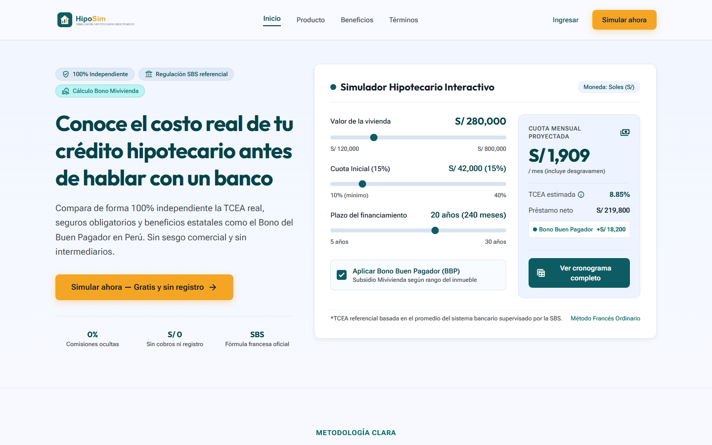

# **Chapter V: Product Implementation**

<div style="text-align: justify; line-height: 1.6;">

Este capítulo presenta la estrategia de implementación y despliegue de **HipoSim**, un simulador hipotecario web y móvil, independiente y dirigido a compradores de primera vivienda en el Perú. La implementación transforma los requerimientos del Capítulo III y el diseño del producto establecido en el Capítulo IV en un conjunto de productos digitales: una Landing Page pública, una Aplicación Web Frontend responsiva, una Aplicación Móvil Nativa, una API RESTful y una base de datos relacional.

También se establecen el entorno de desarrollo, las prácticas de gestión del código fuente, las convenciones de programación, la configuración de despliegue, los Sprint Backlogs, las evidencias de implementación, la documentación del servicio y los criterios de colaboración del equipo. Cuando los capítulos anteriores no proporcionan un enlace de repositorio, despliegue, commit o video, se conserva un campo de evidencia claramente identificado para que el equipo lo complete después de publicar el artefacto correspondiente.

</div>

---

## **5.1. Software Configuration Management**

<div style="text-align: justify; line-height: 1.6;">

La Gestión de la Configuración del Software define las herramientas, convenciones, entornos y prácticas de control de versiones que permiten al equipo construir HipoSim de manera consistente y trazable. Estas decisiones abarcan la gestión del proyecto, requerimientos, diseño UX/UI, desarrollo, pruebas, documentación y despliegue.

</div>

### **5.1.1. Software Development Environment Configuration**

<div style="text-align: justify; line-height: 1.6;">

Las siguientes herramientas soportan el ciclo de vida de HipoSim. La selección es coherente con los capítulos I, III y IV: Vue y Vite para el cliente web; HTML5, CSS3 y JavaScript para la Landing Page; C# y ASP.NET Core para la API RESTful; Entity Framework Core para la persistencia; y PostgreSQL como base de datos relacional.

</div>

<table style="width:100%; border-collapse:collapse; margin:16px 0;">
<thead><tr style="background-color:#0E5C63; color:#FFFFFF;"><th style="border:1px solid #B8C2CC; padding:10px;">Actividad</th><th style="border:1px solid #B8C2CC; padding:10px;">Herramienta</th><th style="border:1px solid #B8C2CC; padding:10px;">Propósito en HipoSim</th><th style="border:1px solid #B8C2CC; padding:10px;">Referencia</th></tr></thead>
<tbody>
<tr><td style="border:1px solid #B8C2CC; padding:9px;">Gestión del proyecto</td><td style="border:1px solid #B8C2CC; padding:9px;">Jira</td><td style="border:1px solid #B8C2CC; padding:9px;">Gestionar épicas, historias de usuario, historias técnicas, Sprint Backlogs, prioridades, responsables y progreso.</td><td style="border:1px solid #B8C2CC; padding:9px;"><a href="https://www.atlassian.com/software/jira">Sitio oficial</a></td></tr>
<tr style="background-color:#F7FAFC;"><td style="border:1px solid #B8C2CC; padding:9px;">Gestión de requerimientos</td><td style="border:1px solid #B8C2CC; padding:9px;">Jira y Markdown</td><td style="border:1px solid #B8C2CC; padding:9px;">Mantener la trazabilidad entre backlog, criterios de aceptación, implementación y documentación.</td><td style="border:1px solid #B8C2CC; padding:9px;"><a href="https://www.markdownguide.org/">Markdown Guide</a></td></tr>
<tr><td style="border:1px solid #B8C2CC; padding:9px;">Diseño UX/UI</td><td style="border:1px solid #B8C2CC; padding:9px;">Figma</td><td style="border:1px solid #B8C2CC; padding:9px;">Crear wireframes, mock-ups, wireflows, flujos de usuario y prototipos web y móviles.</td><td style="border:1px solid #B8C2CC; padding:9px;"><a href="https://www.figma.com/">Sitio oficial</a></td></tr>
<tr style="background-color:#F7FAFC;"><td style="border:1px solid #B8C2CC; padding:9px;">Arquitectura y modelado</td><td style="border:1px solid #B8C2CC; padding:9px;">Structurizr y Lucidchart</td><td style="border:1px solid #B8C2CC; padding:9px;">Formalizar los diagramas C4, de clases y de base de datos.</td><td style="border:1px solid #B8C2CC; padding:9px;"><a href="https://structurizr.com/">Structurizr</a> / <a href="https://www.lucidchart.com/">Lucidchart</a></td></tr>
<tr><td style="border:1px solid #B8C2CC; padding:9px;">Control de versiones</td><td style="border:1px solid #B8C2CC; padding:9px;">Git y GitHub</td><td style="border:1px solid #B8C2CC; padding:9px;">Registrar cambios, aplicar GitFlow, revisar contribuciones y conectar los repositorios con los servicios de despliegue.</td><td style="border:1px solid #B8C2CC; padding:9px;"><a href="https://git-scm.com/">Git</a> / <a href="https://github.com/">GitHub</a></td></tr>
<tr style="background-color:#F7FAFC;"><td style="border:1px solid #B8C2CC; padding:9px;">Desarrollo web</td><td style="border:1px solid #B8C2CC; padding:9px;">VS Code, Node.js, Vue 3, Vite, PrimeVue y Tailwind CSS</td><td style="border:1px solid #B8C2CC; padding:9px;">Desarrollar la aplicación web modular y responsiva respetando el sistema visual del Capítulo IV.</td><td style="border:1px solid #B8C2CC; padding:9px;"><a href="https://vuejs.org/">Vue</a> / <a href="https://vite.dev/">Vite</a></td></tr>
<tr><td style="border:1px solid #B8C2CC; padding:9px;">Landing Page</td><td style="border:1px solid #B8C2CC; padding:9px;">HTML5, CSS3 y JavaScript</td><td style="border:1px solid #B8C2CC; padding:9px;">Implementar la presentación pública, beneficios, términos y llamado a la acción.</td><td style="border:1px solid #B8C2CC; padding:9px;"><a href="https://developer.mozilla.org/">MDN Web Docs</a></td></tr>
<tr style="background-color:#F7FAFC;"><td style="border:1px solid #B8C2CC; padding:9px;">Backend</td><td style="border:1px solid #B8C2CC; padding:9px;">Visual Studio/Rider, .NET, C#, ASP.NET Core y Entity Framework Core</td><td style="border:1px solid #B8C2CC; padding:9px;">Implementar la API, autenticación, cálculos financieros, beneficios, reportes, administración y persistencia.</td><td style="border:1px solid #B8C2CC; padding:9px;"><a href="https://dotnet.microsoft.com/">.NET</a></td></tr>
<tr><td style="border:1px solid #B8C2CC; padding:9px;">Base de datos</td><td style="border:1px solid #B8C2CC; padding:9px;">PostgreSQL y pgAdmin</td><td style="border:1px solid #B8C2CC; padding:9px;">Almacenar usuarios, simulaciones, cronogramas, indicadores, beneficios, comparaciones, reportes y parámetros.</td><td style="border:1px solid #B8C2CC; padding:9px;"><a href="https://www.postgresql.org/">PostgreSQL</a></td></tr>
<tr style="background-color:#F7FAFC;"><td style="border:1px solid #B8C2CC; padding:9px;">Pruebas y documentación de API</td><td style="border:1px solid #B8C2CC; padding:9px;">Swagger/OpenAPI y Postman</td><td style="border:1px solid #B8C2CC; padding:9px;">Documentar endpoints y verificar solicitudes, respuestas, validaciones y autorizaciones.</td><td style="border:1px solid #B8C2CC; padding:9px;"><a href="https://swagger.io/specification/">OpenAPI</a></td></tr>
<tr><td style="border:1px solid #B8C2CC; padding:9px;">Documentación</td><td style="border:1px solid #B8C2CC; padding:9px;">Markdown, HTML y GitHub</td><td style="border:1px solid #B8C2CC; padding:9px;">Mantener el informe técnico versionado y preparado para exportarse a PDF.</td><td style="border:1px solid #B8C2CC; padding:9px;"><a href="https://docs.github.com/en/get-started/writing-on-github">GitHub Docs</a></td></tr>
</tbody></table>

#### **Local Development Environment Baseline**

```text
Node.js: versión LTS aprobada por el equipo
Gestor de paquetes: npm
Frontend: Vue 3 + Vite + PrimeVue + Tailwind CSS
Backend: versión de .NET SDK aprobada por el equipo + ASP.NET Core
ORM: Entity Framework Core
Base de datos: PostgreSQL
Control de versiones: Git
Plataforma remota: GitHub
Contrato de API: OpenAPI
```

### **5.1.2. Source Code Management**

<div style="text-align:justify; line-height:1.6;">

GitHub será la plataforma de control de versiones. Cada producto digital tendrá un repositorio independiente para administrar su historial, incidencias, despliegue y versiones. El repositorio de la API RESTful también incluirá las pruebas unitarias y de integración/aceptación.

</div>

| Producto | Nombre sugerido del repositorio | URL |
|:--|:--|:--|
| Landing Page | `hiposim-landing-page` | *URL* |
| Aplicación Web Frontend | `hiposim-frontend` | *URL* |
| Aplicación Móvil Nativa | `hiposim-mobile` | *URL* |
| API RESTful y pruebas | `hiposim-platform` | *URL* |

#### **GitFlow Workflow**

- `main`: contiene versiones estables, revisadas y desplegables en producción.
- `develop`: integra las funcionalidades terminadas para la siguiente versión.
- `feature/<alcance>-<descripcion-corta>`: implementa una historia; ejemplo: `feature/us01-mortgage-simulation`.
- `release/<mayor>.<menor>.<parche>`: estabiliza una versión candidata; ejemplo: `release/1.0.0`.
- `hotfix/<mayor>.<menor>.<parche>-<descripcion>`: corrige un defecto urgente; ejemplo: `hotfix/1.0.1-tcea-rounding`.

<div style="text-align:justify; line-height:1.6;">

Las ramas `feature` nacen desde `develop` y regresan mediante Pull Request. Las ramas `release` nacen desde `develop` y se fusionan con `main` y `develop`. Las ramas `hotfix` nacen desde `main` y también regresan a ambas ramas permanentes. No se permiten cambios directos en `main`. Las versiones emplean **Versionado Semántico** (`MAYOR.MENOR.PARCHE`) y etiquetas como `v1.0.0`.

Los commits siguen **Conventional Commits**:

</div>

```text
<tipo>(<alcance>): <descripción breve>
```

```text
feat(simulation): calculate mortgage installments with French amortization
feat(benefits): evaluate Good Payer Bonus eligibility
fix(auth): prevent access with an expired token
docs(api): document simulation endpoints
test(financial-engine): add TCEA calculation cases
```

### **5.1.3. Source Code Style Guide & Conventions**

<div style="text-align:justify; line-height:1.6;">

Los identificadores del código y los elementos técnicos se escribirán en inglés. El contenido visible para el usuario permanecerá en español porque HipoSim se dirige a compradores peruanos. El código priorizará claridad, funciones breves, nombres del dominio, separación de responsabilidades y ausencia de reglas duplicadas.

</div>

| Tecnología | Convenciones principales | Referencia |
|:--|:--|:--|
| HTML5 | Elementos semánticos, etiquetas en minúscula, textos `alt` significativos, etiquetas asociadas a campos e indentación consistente. | [Google HTML/CSS Style Guide](https://google.github.io/styleguide/htmlcssguide.html) |
| CSS | Enfoque mobile-first, tokens reutilizables, clases kebab-case, ausencia de valores mágicos y contraste WCAG AA. | [Google HTML/CSS Style Guide](https://google.github.io/styleguide/htmlcssguide.html) |
| JavaScript | `const` por defecto, camelCase para variables y funciones, PascalCase para clases, igualdad estricta y async/await. | [Google JavaScript Style Guide](https://google.github.io/styleguide/jsguide.html) |
| Vue | Componentes PascalCase de varias palabras, un componente por archivo, props explícitas y lógica de negocio en servicios/composables. | [Vue Style Guide](https://vuejs.org/style-guide/) |
| C# / ASP.NET Core | PascalCase para miembros públicos, camelCase para parámetros, sufijo Async, inyección de dependencias y validación de DTO. | [C# Coding Conventions](https://learn.microsoft.com/dotnet/csharp/fundamentals/coding-style/coding-conventions) |
| Gherkin | Un comportamiento por escenario, pasos Given-When-Then declarativos y lenguaje del negocio. | [Gherkin Reference](https://cucumber.io/docs/gherkin/) |

| Elemento | Convención | Ejemplo |
|:--|:--|:--|
| Componente Vue | PascalCase | `SimulationResults.vue` |
| Variable/función JavaScript | camelCase | `calculateMonthlyPayment` |
| Clase/interfaz C# | PascalCase / prefijo `I` | `SimulationService`, `ISimulationRepository` |
| Recurso REST | Sustantivo plural en minúscula | `/api/v1/simulations` |
| Tabla de base de datos | snake_case plural | `simulation_reports` |
| Variable de entorno | UPPER_SNAKE_CASE | `DATABASE_CONNECTION_STRING` |
| Prueba | Nombre orientado al comportamiento | `Calculate_WhenInputIsValid_ReturnsSchedule` |

### **5.1.4. Software Deployment Configuration**

<div style="text-align:justify; line-height:1.6;">

Cada producto debe poder desplegarse desde su repositorio. Los proveedores y enlaces públicos se completarán cuando el equipo publique las aplicaciones. La siguiente configuración describe el flujo exigido sin inventar un proveedor no especificado en los capítulos I-IV.

</div>

#### **Landing Page Deployment**

1. Obtener la última versión aprobada de `main`.
2. Validar HTML, CSS, enlaces, comportamiento responsivo, metadatos y accesibilidad.
3. Publicar los recursos en el servicio de hosting estático seleccionado.
4. Configurar HTTPS y el dominio de producción.
5. Verificar Inicio, Producto, Beneficios, Términos y **Simular ahora**.

#### **Frontend Web Application Deployment**

1. Instalar dependencias con `npm ci`.
2. Configurar la URL de la API mediante una variable de entorno.
3. Ejecutar linting, pruebas automatizadas y `npm run build`.
4. Publicar el directorio `dist` en el servicio seleccionado.
5. Verificar rutas, autenticación, simulación, historial, comparación y breakpoints.

#### **RESTful API and Database Deployment**

1. Restaurar dependencias .NET y compilar en modo Release.
2. Ejecutar pruebas unitarias y de integración.
3. Aprovisionar PostgreSQL y proteger la cadena de conexión.
4. Aplicar las migraciones de Entity Framework Core de forma controlada.
5. Publicar la API ASP.NET Core en el servicio seleccionado.
6. Configurar CORS, HTTPS, tokens seguros y registros centralizados.
7. Verificar el endpoint de salud y la documentación OpenAPI.

#### **Native Mobile Application Deployment**

1. Configurar el endpoint de producción y los identificadores de la aplicación.
2. Generar builds firmados de Android e iOS con credenciales protegidas.
3. Probar tamaños de dispositivo y versiones soportadas.
4. Distribuir una compilación de prueba interna antes de enviarla a las tiendas.
5. Completar metadatos, privacidad, capturas y notas de versión.

| Producto | URL de producción/distribución | Estado |
|:--|:--|:--|
| Landing Page | *Pendiente* | Completar después del despliegue. |
| Aplicación Web Frontend | *Pendiente* | Completar después del despliegue. |
| API RESTful | *Pendiente* | Completar después del despliegue. |
| Aplicación Móvil Nativa | *Pendiente: enlace interno o de tienda* | Completar después de la publicación. |

<div style="page-break-before:always;"></div>

## **5.2. Product Implementation & Deployment**

<div style="text-align:justify; line-height:1.6;">

La implementación se organiza mediante el Product Backlog del Capítulo III. La secuencia prioriza la propuesta de valor: permitir que un comprador calcule una hipoteca, comprenda su costo real y evalúe beneficios estatales antes de incorporar la gestión de escenarios y las funciones administrativas.

</div>

### **5.2.1. Sprint Backlogs**

#### **Sprint 1 - Mortgage Simulation Foundation**

| Campo | Detalle |
|:--|:--|
| Sprint | Sprint 1 |
| Sprint Goal | Nuestro enfoque es entregar la primera simulación hipotecaria completa. Creemos que brinda al comprador una estimación comprensible de cuotas y costo total. Se confirmará cuando ingrese datos válidos y obtenga un cronograma francés con TCEA, VAN y TIR. |
| Elementos planificados | TS01, TS02, US01, US02, US04 |
| Suma de Story Points | **24** |
| Fecha, hora, ubicación y asistentes | *Pendiente: completar con el registro real del Sprint Planning.* |

| Orden | ID | Elemento | SP | Resultado esperado |
|---:|:---:|:--|---:|:--|
| 1 | TS01 | Configurar entorno frontend | 3 | La aplicación Vue/Vite carga con la arquitectura base. |
| 2 | TS02 | Implementar backend y base de datos | 5 | La API ASP.NET Core y el esquema PostgreSQL funcionan. |
| 3 | US01 | Simular crédito base | 5 | Los datos válidos generan una cuota sin exigir registro. |
| 4 | US02 | Ver cronograma de pagos | 3 | Se muestran capital, interés, cuota y saldo mensual. |
| 5 | US04 | Visualizar TCEA, VAN y TIR | 8 | Los indicadores se calculan y destacan en el resultado. |

#### **Sprint 2 - Benefits and Scenario Management**

| Campo | Detalle |
|:--|:--|
| Sprint | Sprint 2 |
| Sprint Goal | Nuestro enfoque es hacer que los resultados sean reutilizables y comparables. Creemos que ayuda a evaluar alternativas y conversar con la familia. Se confirmará cuando el usuario aplique el BBP, se registre, guarde, compare y exporte escenarios. |
| Elementos planificados | US05, US13, US06, US07, US08, TS03 |
| Suma de Story Points | **24** |
| Revisión y retrospectiva previa | *Pendiente: completar con resultados y acciones reales.* |

| Orden | ID | Elemento | SP | Resultado esperado |
|---:|:---:|:--|---:|:--|
| 1 | US05 | Integrar Bono del Buen Pagador | 5 | La elegibilidad y reducción del capital aparecen en el resultado. |
| 2 | US13 | Iniciar sesión y registrarse | 3 | Las cuentas acceden de forma segura a funciones privadas. |
| 3 | US06 | Guardar escenario | 3 | El usuario autenticado conserva simulaciones nombradas. |
| 4 | US07 | Comparar escenarios | 5 | Dos o tres simulaciones se presentan lado a lado. |
| 5 | US08 | Exportar reporte PDF | 5 | El reporte contiene indicadores, gráficos y cronograma. |
| 6 | TS03 | Generación dinámica de reportes | 3 | El cliente genera y descarga el archivo eficientemente. |

#### **Sprint 3 - Advanced Simulation and Administration**

| Campo | Detalle |
|:--|:--|
| Sprint | Sprint 3 |
| Sprint Goal | Nuestro enfoque es mantener parámetros financieros confiables y condiciones avanzadas. Creemos que mejora la exactitud y trazabilidad. Se confirmará cuando funcionen los periodos de gracia y el Administrador pueda actualizar, previsualizar y auditar parámetros. |
| Elementos planificados | US03, US09, US10, US11, US12 |
| Suma de Story Points | **21** |
| Revisión y retrospectiva previa | *Pendiente* |

| Orden | ID | Elemento | SP | Resultado esperado |
|---:|:---:|:--|---:|:--|
| 1 | US03 | Aplicar periodo de gracia | 5 | La gracia total o parcial modifica cuotas y costo total. |
| 2 | US09 | Actualizar tasas referenciales | 3 | La TEA válida se almacena con fecha de vigencia. |
| 3 | US10 | Configurar rangos Mivivienda | 5 | La elegibilidad emplea los rangos configurados. |
| 4 | US11 | Previsualizar impacto | 3 | Se comparan la cuota anterior y la proyectada. |
| 5 | US12 | Historial de auditoría | 5 | Cada cambio registra responsable y fecha. |

### **5.2.2. Implemented Landing Page Evidence**

<div style="text-align:justify; line-height:1.6;">

La Landing Page comunica la propuesta independiente y transparente de HipoSim. Su navegación sigue el Capítulo IV: **Inicio**, **Producto**, **Beneficios** y **Términos**, con el llamado persistente **Simular ahora**. Emplea verde azulado (`#0E5C63`), turquesa (`#3AAFA9`), ámbar (`#F5A524`), Poppins, Roboto, espaciado basado en 8 px y diseño responsivo.

</div>

| Evidencia | Registro requerido |
|:--|:--|
| Repositorio | *URL* |
| Despliegue | *URL* |
| Versión | *Pendiente* |
| Capturas | *Pendiente* |
| Verificación | Navegación, metadatos, enlaces, responsividad, accesibilidad y CTA. |

<!--
<div align="center">
  
  <p><em>Figura 1. Landing Page implementada de HipoSim.</em></p>
</div>
-->

### **5.2.3. Implemented Frontend-Web Application Evidence**

<div style="text-align:justify; line-height:1.6;">

La Aplicación Web responsiva materializa el recorrido principal del comprador: datos del cliente, vivienda, parámetros del crédito y resultados. La vista final presenta cronograma, TCEA, VAN, TIR, beneficios estatales y acciones para guardar, comparar y exportar escenarios.

</div>

| Módulo | Requerimientos | Evidencia esperada |
|:--|:--|:--|
| Autenticación | US13 | Registro, inicio de sesión, rutas protegidas y navegación por rol. |
| Asistente de simulación | US01, US03 | Validación, cuatro pasos, monto, tasa, plazo y gracia. |
| Resultados financieros | US02, US04, US05 | Cuota, cronograma, TCEA, VAN, TIR y BBP. |
| Historial | US06 | Lista de simulaciones y filtros de fecha/tipo. |
| Comparación | US07 | Dos o tres escenarios en paralelo. |
| Reportes | US08, TS03 | PDF con gráficos, indicadores y cronograma. |
| Administración | US09-US12 | Parámetros, previsualización, métricas e historial. |

| Evidencia | Registro requerido |
|:--|:--|
| Repositorio | *PENDIENTE.* |
| Despliegue | *PENDIENTE* |
| Commits/Pull Requests | *Pendiente: identificadores por Sprint.* |
| Capturas | *Pendiente: autenticación, simulación, resultados, historial, comparación y administración.* |

### **5.2.4. Implemented Native-Mobile Application Evidence**

<div style="text-align:justify; line-height:1.6;">

La aplicación móvil conserva las funciones principales: crear una simulación, revisar resultados, consultar historial, comparar escenarios y administrar el perfil. Android utiliza patrones Material, navegación inferior y un botón flotante para una nueva simulación; iOS respeta áreas seguras, navegación nativa y hojas modales, sin perder la identidad visual de HipoSim.

</div>

| Evidencia | Registro requerido |
|:--|:--|
| Repositorio | *PENDIENTE.* |
| Distribución | *Pendiente: enlace de prueba interna o tienda.* |
| Plataformas | Android e iOS. |
| Flujos | Simulación, resultados, historial, comparación y perfil. |
| Capturas | *Pendiente: evidencias de ambas plataformas.* |

### **5.2.5. Implemented RESTful API and/or Serverless Backend Evidence**

<div style="text-align:justify; line-height:1.6;">

HipoSim utiliza una API RESTful con ASP.NET Core y PostgreSQL mediante Entity Framework Core. La API centraliza autenticación, simulaciones, escenarios, reportes, beneficios y parámetros administrativos. El Financial Engine aísla amortización francesa, conversión de tasas, periodos de gracia, VAN, TIR y TCEA; el Benefits Engine evalúa BBP y Nuevo Crédito Mivivienda.

</div>

| Componente | Responsabilidad |
|:--|:--|
| `AuthController` / `AuthService` | Registrar y autenticar Compradores y Administradores; aplicar autorización por roles. |
| `SimulationController` / `SimulationService` | Validar entradas, invocar motores y persistir resultados. |
| `ScenarioController` / `ScenarioService` | Guardar, recuperar y comparar escenarios. |
| `ReportController` / `ReportGenerationService` | Crear PDF y enlaces de solo lectura. |
| `AdminController` / `AdminParameterService` | Gestionar tasas, BBP, rangos, métricas e historial. |
| `FinancialEngine` | Calcular amortización, tasas, gracia, VAN, TIR y TCEA. |
| `BenefitsEngine` | Determinar elegibilidad y recalcular el monto financiado. |
| Repositorios | Persistir agregados en PostgreSQL. |

| Evidencia | Registro requerido |
|:--|:--|
| Repositorio | *PENDIENTE* |
| Despliegue | *PENDIENTE* |
| Migración | *PENDIENTE* |
| Pruebas | *PENDIENTE* |
| Salud | *PENDIENTE* |

### **5.2.6. RESTful API Documentation**

<div style="text-align:justify; line-height:1.6;">

La API debe publicar un contrato OpenAPI y una interfaz Swagger UI. El diseño siguiente deriva de las historias y arquitectura de los capítulos III y IV. Las rutas y esquemas finales deberán coincidir con la implementación.

</div>

| Método | Recurso | Propósito | Requerimiento |
|:--:|:--|:--|:--:|
| `POST` | `/api/v1/auth/register` | Registrar una cuenta de Comprador. | US13 |
| `POST` | `/api/v1/auth/login` | Autenticar Comprador o Administrador. | US13 |
| `POST` | `/api/v1/simulations` | Calcular una simulación. | US01, US03, US04, US05 |
| `GET` | `/api/v1/simulations/{id}` | Obtener una simulación autorizada. | US02, US06 |
| `GET` | `/api/v1/simulations` | Listar simulaciones guardadas. | US06 |
| `POST` | `/api/v1/comparisons` | Comparar dos o tres escenarios. | US07 |
| `GET` | `/api/v1/simulations/{id}/report` | Generar u obtener el PDF. | US08, TS03 |
| `GET` | `/api/v1/admin/parameters` | Consultar parámetros vigentes. | US09, US10 |
| `PUT` | `/api/v1/admin/parameters/{key}` | Actualizar un parámetro autorizado. | US09, US10 |
| `POST` | `/api/v1/admin/parameters/{key}/preview` | Previsualizar un cambio. | US11 |
| `GET` | `/api/v1/admin/parameters/{key}/history` | Consultar historial de auditoría. | US12 |
| `GET` | `/health` | Verificar disponibilidad. | TS02 |

#### **Representative Simulation Request**

```json
{
  "propertyPrice": 280000.00,
  "downPayment": 56000.00,
  "annualEffectiveRate": 0.085,
  "termInMonths": 240,
  "gracePeriodMonths": 0,
  "graceType": "none",
  "applyGoodPayerBonus": true
}
```

#### **Representative Simulation Response**

```json
{
  "simulationId": "generated-id",
  "financedAmount": 224000.00,
  "monthlyInstallment": 1943.52,
  "tcea": 0.0941,
  "npv": 224000.00,
  "irr": 0.0075,
  "benefit": {
    "name": "Good Payer Bonus",
    "eligible": true,
    "appliedAmount": 0.00
  },
  "amortizationSchedule": []
}
```

| Evidencia de documentación | Registro requerido |
|:--|:--|
| OpenAPI | *PENDIENTE* |
| Swagger UI | *PENDIENTE* |
| Colección Postman | *PENDIENTE* |

### **5.2.7. Team Collaboration Insights**

<div style="text-align:justify; line-height:1.6;">

La colaboración se evalúa mediante contribuciones trazables. Jira registra la propiedad y estado de los elementos; GitHub registra ramas, commits, Pull Requests, revisiones y releases. El trabajo debe distribuirse según la prioridad y las habilidades descritas en el Capítulo I, manteniendo responsabilidad compartida por integración y calidad.

</div>

#### **Collaboration Agreements**

- Cada tarea se vincula con una historia de usuario o técnica.
- Cada funcionalidad se desarrolla en su propia rama GitFlow.
- Los Pull Requests describen propósito, backlog relacionado, pruebas y evidencia visual.
- Al menos un compañero revisa el Pull Request antes de integrarlo en `develop`.
- Los conflictos se resuelven entre los autores de las áreas afectadas.
- El Sprint Review valida el producto integrado contra los criterios de aceptación.
- La retrospectiva registra un acierto, un problema y una acción de mejora.
- Los secretos nunca se comparten mediante commits ni mensajes.

<table style="width:100%; border-collapse:collapse; margin:16px 0;">
<thead><tr style="background-color:#0E5C63; color:#FFFFFF;"><th style="border:1px solid #B8C2CC; padding:10px;">Integrante</th><th style="border:1px solid #B8C2CC; padding:10px;">Código</th><th style="border:1px solid #B8C2CC; padding:10px;">Contribución</th><th style="border:1px solid #B8C2CC; padding:10px;">Evidencia</th></tr></thead>
<tbody>
<tr><td style="border:1px solid #B8C2CC; padding:9px;">Bautista Rivera, Jose Diego</td><td style="border:1px solid #B8C2CC; padding:9px;">U202310949</td><td style="border:1px solid #B8C2CC; padding:9px;"><em>Pendiente de asignación real.</em></td><td style="border:1px solid #B8C2CC; padding:9px;"><em>Pendiente: commits/PR.</em></td></tr>
<tr style="background-color:#F7FAFC;"><td style="border:1px solid #B8C2CC; padding:9px;">Carlos Lavado, Ever Giusephi</td><td style="border:1px solid #B8C2CC; padding:9px;">U202224867</td><td style="border:1px solid #B8C2CC; padding:9px;"><em>Pendiente de asignación real.</em></td><td style="border:1px solid #B8C2CC; padding:9px;"><em>Pendiente: commits/PR.</em></td></tr>
<tr><td style="border:1px solid #B8C2CC; padding:9px;">Daga Chávez, Joaquín Leonardo</td><td style="border:1px solid #B8C2CC; padding:9px;">U202219829</td><td style="border:1px solid #B8C2CC; padding:9px;"><em>Pendiente de asignación real.</em></td><td style="border:1px solid #B8C2CC; padding:9px;"><em>Pendiente: commits/PR.</em></td></tr>
<tr style="background-color:#F7FAFC;"><td style="border:1px solid #B8C2CC; padding:9px;">Janampa Gutierrez, Jhoan Darner</td><td style="border:1px solid #B8C2CC; padding:9px;">U202323319</td><td style="border:1px solid #B8C2CC; padding:9px;"><em>Pendiente de asignación real.</em></td><td style="border:1px solid #B8C2CC; padding:9px;"><em>Pendiente: commits/PR.</em></td></tr>
<tr><td style="border:1px solid #B8C2CC; padding:9px;">López Roman, Franco Mauricio</td><td style="border:1px solid #B8C2CC; padding:9px;">U202315890</td><td style="border:1px solid #B8C2CC; padding:9px;"><em>Pendiente de asignación real.</em></td><td style="border:1px solid #B8C2CC; padding:9px;"><em>Pendiente: commits/PR.</em></td></tr>
<tr style="background-color:#F7FAFC;"><td style="border:1px solid #B8C2CC; padding:9px;">Olivares Lao, Gustavo Alonso</td><td style="border:1px solid #B8C2CC; padding:9px;">U202216448</td><td style="border:1px solid #B8C2CC; padding:9px;"><em>Pendiente de asignación real.</em></td><td style="border:1px solid #B8C2CC; padding:9px;"><em>Pendiente: commits/PR.</em></td></tr>
</tbody></table>

<div style="page-break-before:always;"></div>

## **5.3. Video About-the-Product**

<div style="text-align:justify; line-height:1.6;">

El video debe comunicar el valor de HipoSim de forma breve y demostrable. Debe explicar el problema de los compradores primerizos, presentar la simulación independiente, identificar los roles Comprador y Administrador, y demostrar el flujo principal desde la Landing Page hasta el resultado hipotecario.

</div>

#### **Recommended Video Structure**

1. **Problema y segmento:** explicar la falta de una herramienta simple, independiente y transparente.
2. **Propuesta de valor:** presentar cuotas, TCEA, VAN, TIR, periodos de gracia y beneficios.
3. **Landing Page:** mostrar información, beneficios, términos y **Simular ahora**.
4. **Simulación:** ingresar vivienda, cuota inicial, tasa, plazo y periodo de gracia.
5. **Interpretación:** explicar cronograma, TCEA y elegibilidad al BBP en lenguaje sencillo.
6. **Usuario registrado:** demostrar guardado, comparación, historial y exportación PDF.
7. **Administración:** mostrar actualización, previsualización y auditoría de parámetros.
8. **Cierre:** aclarar que HipoSim informa, pero no sustituye la evaluación formal del banco.

| Campo | Registro |
|:--|:--|
| Título | HipoSim - Acerca del Producto |
| Plataforma | Microsoft Stream |
| URL | *Pendiente: insertar el enlace accesible.* |
| Miniatura | *Pendiente: insertar una captura del video.* |
| Validación de acceso | *Pendiente: comprobar el acceso de docentes y evaluadores.* |
